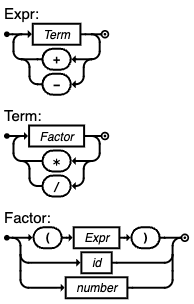

<!-- _class: lead -->
<!-- _paginate: skip -->
# Контекстно-свободные грамматики

---
## Определение
- КС‑грамматика: $G=\langle N, T, P, S\rangle$
- Правила: только $A \to \beta$
  - $A \in N$, $\beta \in (N\cup T)^*$ (включая $\epsilon$ при оговорённых условиях)
- Эквивалентная модель: магазинный автомат (PDA)

---
## Способы записи
- Формальная запись, как в книге
- БНФ: `<E> ::= <E> "+" <T> | <T>`
- Расширенная БНФ (EBNF): повторения `{...}`, необязательность `[...]`
- Синтаксические диаграммы (железнодорожные)
- Грамматики инструментов (ANTLR, Yacc/Bison)

---
## <!--fit--> Пример одной грамматики в разных нотациях (1)
- Инфиксные выражения с приоритетом `*` над `+`
- БНФ:
```
<Expr> ::= <Expr> "+" <Term> | <Term>
<Term> ::= <Term> "*" <Factor> | <Factor>
<Factor> ::= "(" <Expr> ")" | id | number
```

---
## <!--fit--> Пример одной грамматики в разных нотациях (2)
- EBNF:
```
Expr   ::= Term { ("+"|"-") Term }
Term   ::= Factor { ("*"|"/") Factor }
Factor ::= "(" Expr ")" | id | number
```

---
## <!--fit--> Пример одной грамматики в разных нотациях (3)
- ANTLR:
```antlr
grammar Expr;
expr   : term (('+'|'-') term)* ;
term   : factor (('*'|'/') factor)* ;
factor : '(' expr ')' | ID | NUMBER ;
```
---
## <!--fit--> Пример одной грамматики в разных нотациях (4)
- Синтаксическая диаграмма


---
## Двусмысленность (ambiguity)
- Грамматика:
```
E ::= E "+" E | E "*" E | "(" E ")" | id
```
- Двусмысленна: для `id + id * id` есть два разных дерева
- Разрешение: закодировать приоритет/ассоциативность, как в примере с `Expr/Term/Factor`

---
## Леворекурсия и её устранение
- Непосредственная левая рекурсия: `A ::= A α | β`
- Преобразование:
```
A  ::= β A'
A' ::= α A' | ε
```
- Пример: `Expr ::= Expr "+" Term | Term` →
```
Expr  ::= Term Expr'
Expr' ::= "+" Term Expr' | ε
```
- Важна для LL(1)‑парсеров (рекурсивный спуск)

---
## Левофакторизация (left factoring)
- Когда альтернативы имеют общий префикс
```
S ::= "if" "(" E ")" S "else" S | "if" "(" E ")" S
```
- Факторизация:
```
S  ::= "if" "(" E ")" S S'
S' ::= "else" S | ε
```
- Решает «висячее else»: по умолчанию `else` связывается с ближайшим `if`

---
## Выводы и деревья разбора (1)
- Левосторонний/правосторонний выводы приводят к одному и тому же дереву для однозначной грамматики
```
1) Expr  -> Term Expr'
2) Expr' -> "+" Term Expr'
3) Expr' -> ε
4) Term  -> Factor Term'
5) Term' -> "*" Factor Term'
6) Term' -> ε
7) Factor -> "(" Expr ")" 
8) Factor -> id
```

---
## Выводы и деревья разбора (2)
- Пример вывода `id + id * id` (по EBNF‑грамматике):
```
Expr -(1)> Term Expr' -(4)> Factor Term' Expr' 
	-(8)> id Term' Expr' -(6)> id Expr' -(2)> id + Term Expr'
	-(4)> id + Factor Term' Expr' -(8)> id + id Term' Expr'
	-(5)> id + id * Factor Expr' -(8)> id + id * id Expr'
	-(3)> id + id * id
```
- Дерево разбора отражает приоритет: `*` глубже, чем `+`

---
## Выводы и деревья разбора (3)
```plantuml
digraph SyntacsTree {
	fontname="Helvetica,Arial,sans-serif"
	node [fontname="Helvetica,Arial,sans-serif"]
	edge [fontname="Helvetica,Arial,sans-serif"]
	node [shape=box];  {node [label="Term'"] Term2; Term3; Term4}; {node [label="Term"]; Term00; Term01}; Expr; {node [label="Factor"] Factor1; Factor2; Factor3}; {node [label="Expr'"] Expr2; Expr3}
	node [shape=circle]; {node [label="id"] id1; id2; id3}; {node [label="ε"] e1; e2; e3};

	Expr -> Term00 
	Expr -> Expr2
	
	Term00 -> Factor1
	Term00 -> Term2
	{ rank=same; Factor1 -> Term2 [style=invis]; }
	
	Factor1 -> id1

    Term2 -> e1

	Expr2 -> "+"
	Expr2 -> Term01
	Expr2 -> Expr3
	
	Term01 -> Factor2
	Term01 -> Term3
	
	Factor2 -> id2
	Term3 -> "*"
	Term3 -> Factor3
	Term3 -> Term4
	{ rank=same; "*" -> Factor3 [style=invis]; }
	
	Factor3 -> id3
	Term4 -> e3
	
	Expr3 -> e2
}
```

---
## FIRST/FOLLOW и LL(1)
- `FIRST(X)`: множество терминалов, начинающих вывод из `X` (включая `ε` при необходимости)
- `FOLLOW(A)`: терминалы, которые могут следовать сразу после `A`
- Условие LL(1): множества для альтернатив непересекаемы, корректная обработка `ε`
- Результат: предиктивный парсер без бэктрекинга, таблица разбора `M[A, a]`

---
## Краткий пример LL(1)‑таблицы
Для грамматики после устранения левой рекурсии:
```
Expr  ::= Term Expr'
Expr' ::= "+" Term Expr' | ε
Term  ::= Factor Term'
Term' ::= "*" Factor Term' | ε
Factor::= "(" Expr ")" | id
```
- `FIRST(Factor) = {(, id}` → в строке `Factor` столбцы `(` и `id` содержат соответствующие правила

---
## LR‑семейство (восходящий разбор)
- Идея: сдвиг/свёртка по автомату LR‑состояний (элементы/айтемы)
- Варианты: LR(0), SLR(1), LALR(1), LR(1)
- Преимущества: широкий класс грамматик, хорошая диагностика ошибок, генераторы (Bison)
- Недостатки: более сложные таблицы/реализация

---
## Магазинные автоматы (PDA)
- $\langle Q, \Sigma, \Gamma, \delta, q_0, Z_0, F\rangle$, где $\Gamma$ — алфавит стека
- $\delta: Q\times (\Sigma\cup\{\epsilon\}) \times \Gamma \to 2^{Q\times \Gamma^*}$
- Пример для сбалансированных скобок: при чтении `(` — кладём в стек, при чтении `)` — снимаем; принимаем при пустом стеке
- Эквивалентность: КС‑языки ⇄ PDA

---
## Типовые конструкции: объявления переменных
```
decl     : type ID ("=" expr)? ("," ID ("=" expr)? )* ";"
type     : "int" | "float" | "bool" | "string"
ID       : [A-Za-z_][A-Za-z0-9_]*
```

---
## Типовые конструкции: условие и "висячее else"
```
stmt    : if_stmt | block | assign ";"
if_stmt : "if" "(" expr ")" stmt [ "else" stmt ]
block   : "{" { stmt } "}"
assign  : ID "=" expr
```
- По умолчанию `else` связывается с ближайшим `if`

---
## Типовые конструкции: switch/case
```
switch  : "switch" "(" expr ")" "{" case* [ default ] "}"
case    : "case" const ":" { stmt }
default : "default" ":" { stmt }
```

---
## Типовые конструкции: подпрограммы
```
funcDef ::= "function" ID "(" [ param ( "," Param )* ] ")" block
param   : ID [ ":" type ]
call    : ID "(" [ arg ( "," Arg )* ] ")"
arg     : expr
```

---
<!-- _class: lead -->
# Вопросы

---
## Дополнительное задание
Найти >2 варианта применения грамматик, кроме проверки текстов на формальных или естественных языках.