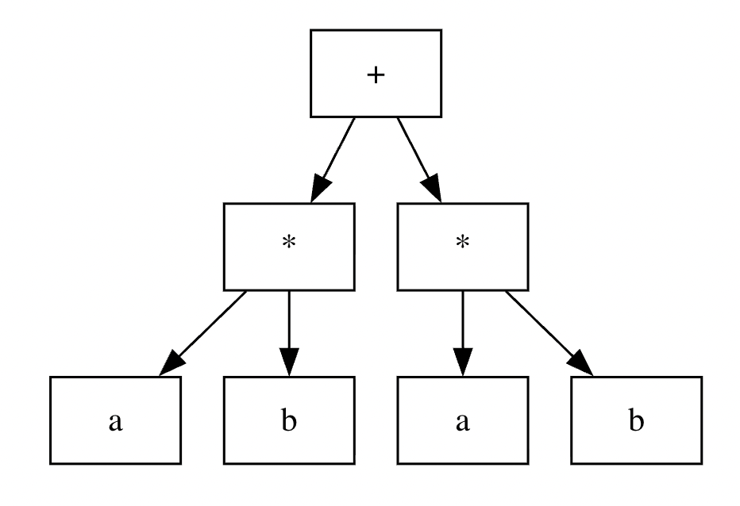
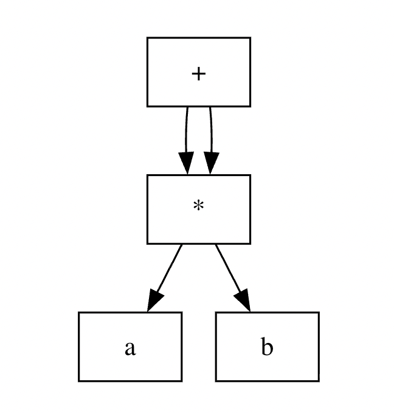
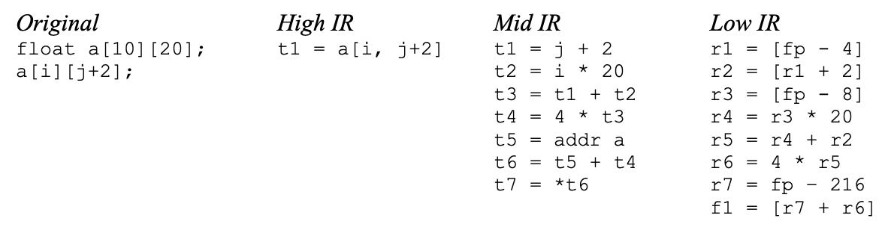

<!-- _class: lead -->
<!-- _paginate: skip -->
# Генерация промежуточного кода

---
## Виды промежуточного кода
- Абстрактное синтаксическое дерево (AST)
- Ориентированный ацикличный граф (DAG)
- Трехадресный код (TAC)

---
## <!--fit--> Абстрактное синтаксическое дерево
- Узлы - конструкции в исходной программе
- Дочерние узлы - значимые элементы конструкции

---
## Пример
a * b + a * b


<!--
```plantuml
digraph AST {
node [shape=box];
plus [label="+"];
mult1 [label="*"];
a1 [label="a"];
b1 [label="b"];
mult2 [label="*"];
a2 [label="a"];
b2 [label="b"];
plus -> mult1;
plus -> mult2;
mult1 -> a1;
mult1 -> b1;
mult2 -> a2;
mult2 -> b2;
}
```
-->

---
## <!--fit--> Ориентированный ацикличный граф (DAG)
Объединяются общие подвыражения


<!--
```plantuml
digraph DAG {
node [shape=box];
plus [label="+"];
mult [label="*"];
a [label="a"];
b [label="b"];
plus -> mult;
plus -> mult;
mult -> a;
mult -> b;
}
```
-->

---
## Трехадресный код
`x = y op z`
- код команды
- адрес результата
- адрес первого и второго аргумента

---
## Пример
 a * b + a * b
 ```
 t1 = a * b
 t2 = a * b
 t3 = t1 + t2
 ```

---

## Набор команд TAC (1)
- Арифметические и логические операции
	- `x = y op z` и `x = op y`
- Присваивания и перемещение данных
	- `x = y`
	- `x = *y` и `*x = y`
	- `x = y[i]` и `x[i] = y` 
- Управление потоком
	- `goto L`
	- `if x relop y goto L`
	- `label L:`

---
## Набор команд TAC (2)
- Поддержка функций/процедур
	- `param x`
	- `call p, n`
	- `x = call p, n`
	- `return x`
- Специальные инструкции
	- `x = &y`
	- `x = y.f` и `x.f = y`

---
## Static Single Assignment (SSA)
```
x := 10
y := x + 5
x := 20
z := x + y
```

```
x1 := 10
y1 := x1 + 5
x2 := 20
z1 := x2 + y1
```

---
## Реализация трехадресных инструкций
- Четверки
- Тройки
- Косвенные тройки

---
## Уровни промежуточного кода


---
## <!--fit--> Основные архитектуры виртуальных машин
- Стековая
- Регистровая

---
## Стековая виртуальная машина
- `PUSH value`, `POP`
- `DUP`, `SWAP`
- `LOAD addr`, `STORE addr`
- `CALL addr`, `RET`

---
## Пример (1)
```
PUSH 5        // n = 5
CALL fact     // вызов функции
PRINT         // вывод результата
HALT

fact:
  DUP         // дублировать n
  PUSH 1
  CMP         // n <= 1?
  JMPT base   // если да, базовый случай  
```

---
## Пример (2)
```
  DUP         // иначе n * fact(n-1)
  PUSH 1
  SUB         // n-1
  CALL fact   
  MUL         // n * fact(n-1)
  RET
  
base:
  POP         // убрать лишнее значение
  PUSH 1      // вернуть 1
  RET
```

--- 
## Регистровая виртуальная машина
- Набор виртуальных регистров (обычно 16-256)
```
LOAD R0, address     // загрузить значение из памяти в регистр R0
ADD R1, R2, R3       // R1 = R2 + R3
STORE R1, address    // сохранить значение из R1 в память
```
---
## <!--fit--> Варианты в лабораторном практикуме (1)
- Байт-код JVM
	- JASM (https://github.com/roscopeco/jasm)
- Байт-код .NET
	- ILASM
- LLVM IR
	- llvm-as, llvmlite

---
## <!--fit--> Варианты в лабораторном практикуме (2)
- Байт-код CPython (.pyc)
	- python-xasm (https://github.com/rocky/python-xasm), python-reassembler
- WASM
	- WAT

