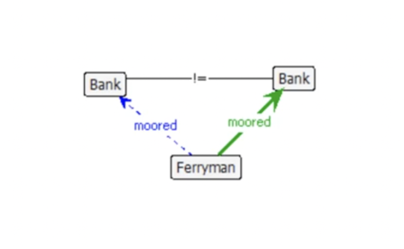
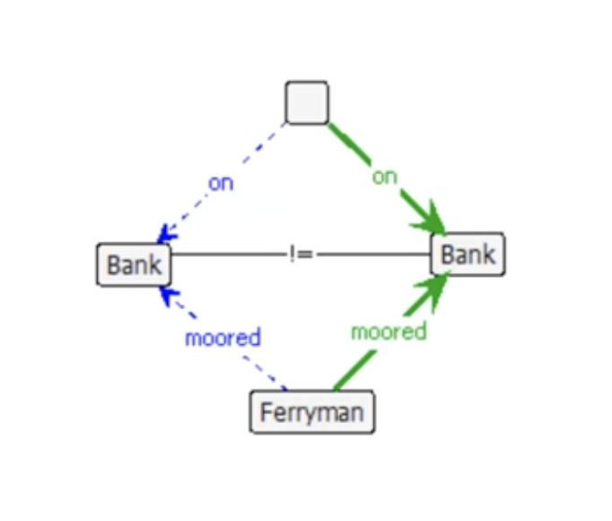
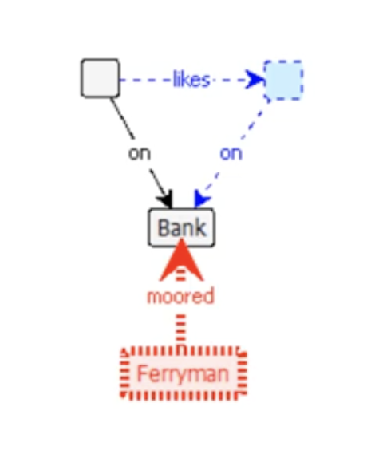
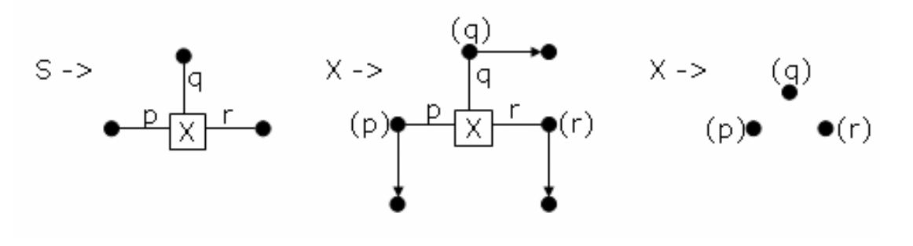
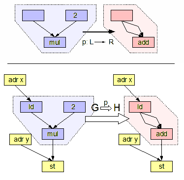

<!-- _class: lead -->
<!-- _paginate: skip -->
# Графовые грамматики
---
## От строк к графам

**Графовые грамматики** работают со **структурами**:
- Узлы и ребра (связи).
- Правила замены подграфов.
- Результат: многомерная топология произвольной сложности.

---
## Определение графовой грамматики

Графовая грамматика — это система $GG = (AX, P)$, где:
- **AX (Axiom)** — стартовый граф (аналог начального символа $S$).
- **P (Productions)** — набор правил трансформации графа.

Каждое правило $p \in P$ имеет вид $L \to R$, где:
- **L (Left-hand side)** — подграф, который мы ищем (образец).
- **R (Right-hand side)** — подграф, на который заменяем.

---
## Как работает продукция

Применение правила $L \to R$ к графу $G$ (Host Graph):

1.  **Matching (Сопоставление):** Найти в графе $G$ вхождение подграфа, изоморфного $L$.
2.  **Removal (Удаление):** Удалить найденный подграф $L$ из $G$.
3.  **Insertion (Вставка):** Добавить граф $R$ в $G$.
4.  **Embedding (Встраивание/Склейка):** Восстановить связи между новым подграфом $R$ и остальной частью графа $G$ (самая сложная часть).

---
## Пример Groove
- Синее - удаляются
- Зеленое - добавляется
- Красное - должно отсутствовать
---

---

---

---
## Пример (1)

---
## Пример (2)

---
## Практическое применение

1.  Рефакторинг кода
2.  Model Driven Engineering (MDE)
3. Визуальные языки
4. Процедурная генерация
