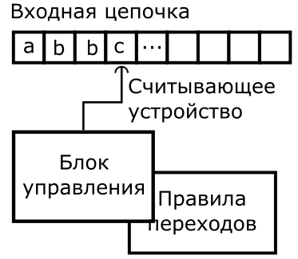
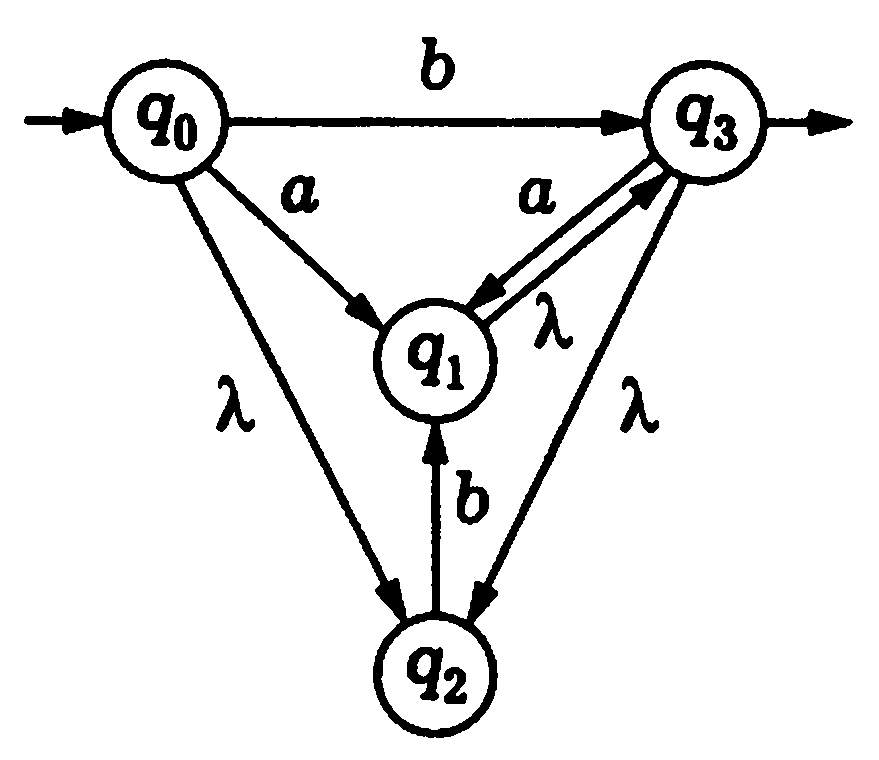
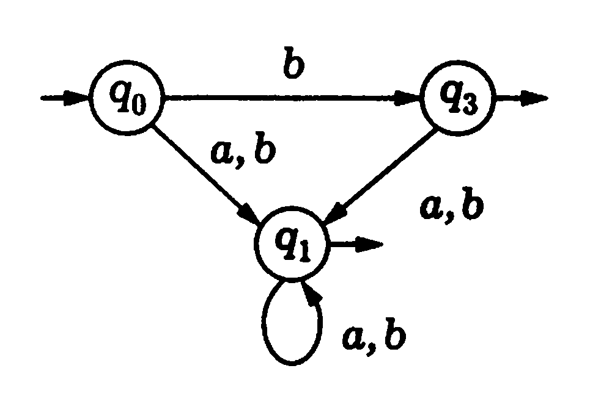
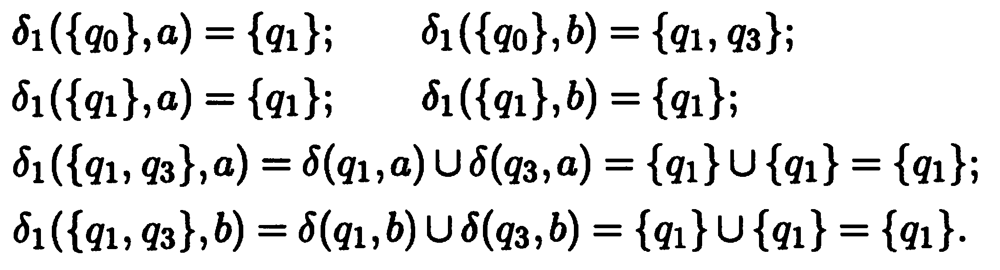
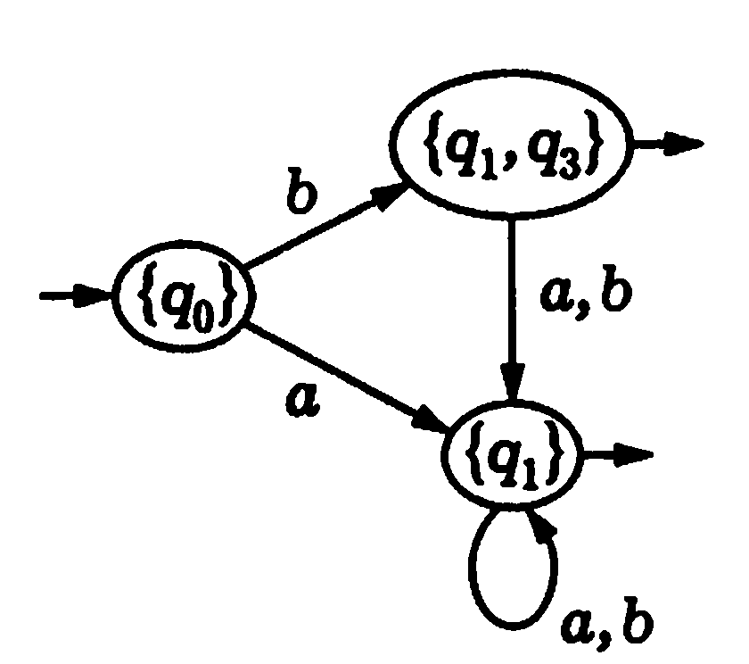
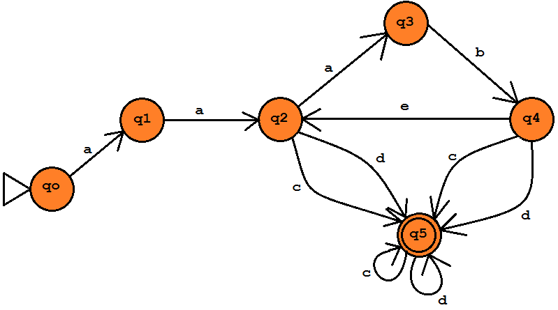
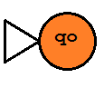
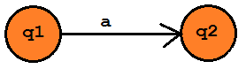
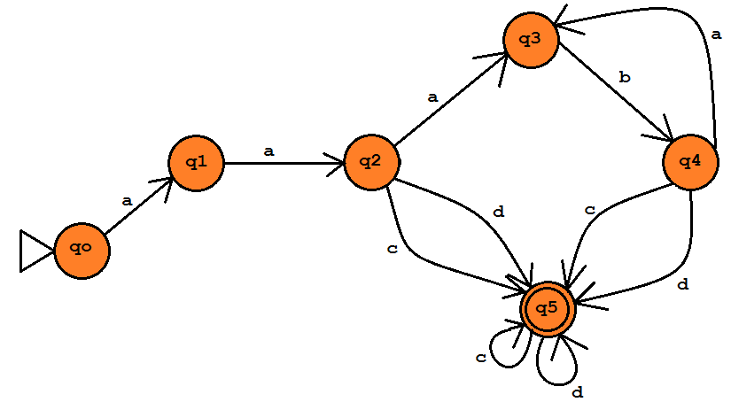
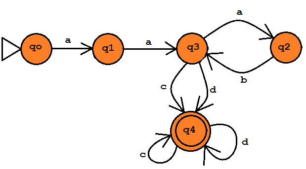

<!-- Перенесено из Google Docs «Практические задачи» (2026-09-24).
     Источник правды теперь этот файл; рисунки — docs/practice/img/. -->

# Задача 1. Построение конечного автомата

*[Практические занятия](index.md#tema-2) · слайды: [04. Регулярные грамматики](../lectures/html/04-regulyarnye-grammatiki.html) ·
[условие](#uslovie) · [варианты](#varianty) · [пример решения](#primer)*

## Теоретические сведения { #teoriya }

<strong>Регуля́рные выраже́ния (</strong>англ. <strong>regular expressions)</strong> — формальный язык поиска и осуществления манипуляций с подстроками в тексте, основанный на использовании метасимволов (символов-джокеров, англ. wildcard characters). По сути это строка-образец (англ. pattern, по-русски её часто называют «шаблоном», «маской»), состоящая из символов и метасимволов и задающая правило поиска.

<strong>Регуля́рный язык (регуля́рное мно́жество)</strong> в теории формальных языков – это формальный язык, который может быть выражен средствами регулярных выражений. Класс регулярных множеств удобно изучать в целом, а полученные результаты оказываются применимы для достаточно широкого спектра формальных языков.

Пусть Σ — конечный [алфавит](https://ru.wikipedia.org/w/index.php?title=%D0%A4%D0%BE%D1%80%D0%BC%D0%B0%D0%BB%D1%8C%D0%BD%D1%8B%D0%B9_%D0%B0%D0%BB%D1%84%D0%B0%D0%B2%D0%B8%D1%82&action=edit&redlink=1). Регулярный язык R(Σ) в алфавите Σ определяется следующими рекурсивными свойствами:

| <strong>№</strong> | <strong>Свойство</strong> | <strong>Описание</strong> |
|---|---|---|
| <strong>1</strong> | øЄR(Σ) | Пустое множество является регулярным множеством в алфавите Σ |
| <strong>2</strong> | {ε}ЄR(Σ) | Множество, состоящее из одной лишь пустой строки, является регулярным множеством в алфавите Σ |
| <strong>3</strong> | Для любого aЄΣ:{a}ЄR(Σ) | Множество, состоящее из одного любого символа алфавита Σ является регулярным множеством в алфавите Σ |
| <strong>4</strong> | PЄR(Σ)˄Q ЄR(Σ)→(PUQ) ЄR(Σ) | Если два какие-либо множества являются регулярными в алфавите Σ, то и их объединение тоже является регулярным множеством в алфавите Σ |
| <strong>5</strong> | PЄR(Σ)˄Q ЄR(Σ)→PQ ЄR(Σ) | Если два какие-либо множества являются регулярными в алфавите Σ, то и множество, составленное из всевозможных сцеплений пар их элементов, тоже является регулярным множеством в алфавите Σ |
| <strong>6</strong> | PЄR(Σ)→P\* ЄR(Σ) | Если какое-либо множество является регулярным в алфавите Σ, то множество всевозможных сцеплений его элементов тоже является регулярным множеством в алфавите Σ |

Ничто другое, кроме следующего из перечисленного, не является регулярным множеством в алфавите Σ

Регулярное выражение строится из более простых регулярных выражений с использованием набора правил. Каждое регулярное выражение r обозначает, или задает язык L(r). Правила определяют, каким образом из языков, заданных подвыражениями r, формируется L(r).

После любого элемента регулярного выражения может следовать очень важный тип метасимвола – повторитель.

| Повторитель | Значение |
|---|---|
| `*` | ноль или более раз, то же что {0,…,∞} |
| `+` | один или более раз, то же что {1,…,∞} |
| `?` | ноль или один раз, то же что {0,1} |
| `{n}` | точно n раз |
| `{n,}` | не менее n раз |
| `{n,m}` | не менее n, но не более m раз |

Правила, которые <strong>определяют регулярные выражения над алфавитом E</strong>.

1. <strong>Е</strong> представляет собой регулярное выражение, обозначающее <strong>{e}</strong>, т.е. множество, содержащее пустую строку.
1. Если а является символом из <strong>Е</strong>, то <strong>а</strong> – регулярное выражение, обозначающее <strong>{a}</strong>, т.е. множество, содержащее строку <strong>а</strong>. Хотя мы используем одну и ту же запись, технически регулярное выражение <strong>а</strong> отличается от строки <strong>а</strong> и символа <strong>а</strong>. Говорим ли мы о регулярном выражении, строке или символе – становится понятно из контекста.
1. Предположим, что <strong>r</strong> и <strong>s</strong> – регулярные выражения, обозначающие языки <strong>L(r)</strong> и <strong>L(s)</strong>.

Тогда:

- <strong>(r)|(s)</strong> представляет собой регулярное выражение, обозначающее <strong>L(r)</strong> и <strong>L(s)</strong>.
- <strong>(r)(s)</strong> – регулярное выражение, обозначающее <strong>L(r)L(s)</strong>.
- <strong>(r)\*</strong> -  регулярное выражение, обозначающее <strong>(L(r))\*</strong>.
- <strong>(r)</strong> – регулярное выражение, обозначающее  <strong>L(r)</strong>.

Излишние скобки в регулярном выражении могут быть устранены, если принять следующие соглашения:

1. Унарный оператор \* имеет высший приоритет и левоассоциативен.
1. Конкатенация имеет второй по значимости приоритет и левоассоциативна.
1. | (объединение) имеет низший приоритет и левоассоциативно.

<em>При этих соглашениях запись (a)|((b)\*(c)) эквивалентна a|b\*c</em>

<strong>ПРИМЕР</strong>

Пусть <strong>Е = {a,b}</strong><em>.</em>

1. Регулярное выражение <strong>a|b</strong> обозначает множество <strong>{a,b}</strong>.
1. Регулярное выражение <strong>(a|b)(a|b)</strong> – <strong>{aa, ab, ba,bb}</strong>,  множество всех строк из <strong>а</strong> и <strong>b</strong> длины 2. Другое регулярное выражение для того же множества  –  <strong>аа | ab | ba | bb</strong>.
1. Регулярное выражение <strong>а\*</strong> - множество всех строк из нуля или более а, т.е. <strong>{e, a, aa,aaa, …}</strong>.
1. Регулярное выражение <strong>(a|b)\*</strong> обозначает множество всех строк, содержащих нуль или несколько  экземпляров <strong>а</strong> и <strong>b</strong>, т е множество всех строк из <strong>а</strong> и <strong>b</strong>.  Другое регулярное выражение для этого множества – <strong>(а\*b\*)\*</strong>.
1. Регулярное выражение <strong>а| a\*b</strong> – множество содержащее строку <strong>а</strong> и все ее строки, состоящие из нуля или нескольких <strong>а</strong>, за которыми следует <strong>b</strong>.
1. (a|b)\*(a|b)(a|b)\* - обозначает множество всех непустых цепочек, состоящих из a и b, т.е. множество {a, b}+;

Если два регулярных выражения r и s задают один и тот же язык, то r и s называются <em>эквивалентными</em>, т.е. r = s. Например, (a|b) = (b|a).

Имеется ряд алгебраических законов, используемых для преобразования регулярных выражений в эквивалентные. Ниже приведены некоторые из этих законов для регулярных выражений r, s и t.

<strong>Алгебраические свойства регулярных выражений</strong>

| <strong>Аксиома</strong> | <strong>Описание</strong> |
|---|---|
| r\|s = s\|r | Оператор \| коммутативен |
| r\|(s\|t) = (r\|s)\|t | Оператор \| ассоциативен |
| (rs)t = r(st) | Конкатенация ассоциативна |
| r(s\|t) = rs\|rt<br>(s\|t)r = sr\|tr | Конкатенация дистрибутивна над \| |
| er = r<br>re = r | e является единичным элементом по отношению к конкатенации |
| r\* = (r\|e)\* | Связь между <strong>\*</strong> и <strong>е</strong> |
| r\*\* = r\* | Оператор \* идемпотентен |

Регулярные выражения, введенные ранее, служат для описания регулярных множеств. Для распознавания регулярных множеств служат <strong>конечные автоматы.</strong>

<strong>Конечный автомат (КА)</strong> — это преобразователь, который позволяет сопоставить входу соответствующий выход, причем выход этот может зависеть не только от текущего входа, но и от того, что происходило раньше, от предыстории работы конечного автомата.

<em>Пример работы примитивного КА:</em>  
{ width="279" }

Данный КА состоит из:

- ленты, представленной входной цепочкой;
- считывающее устройство;
- блок управления, который содержит список правил переходов.

Считывающее устройство может двигаться в одном направлении, как правило, слева на право, тем самым считывая символы входной цепочки. За каждое такое движение оно может считать один символ. Далее, считанный символ передается блоку управлений. Блок управления изменяет состояние автомата на основе правил переходов. Если список правил переходов не содержит правила для считанного символа, то автомат «умирает».

<strong>Способы задания конечного автомата.</strong> Они могут задаваться в виде графов или в виде управляющих таблиц.

В виде графа КА задается следующим способом:

- вершины графа, соответствуют состояниям КА;
- направленные ребра, соответствуют функциям переходов (возле каждого такого ребра указывается символ, по которому выполняется переход);
- вершина с входящим в него ребром, которое не выходит не из одного состояния, соответствует начальному состоянию;
- конечные состояния КА помечаются двойным контуром.

В виде управляющей таблицы задается так:

- состояния КА располагаются в строках таблицы;
- символы распознаваемого языка — в столбцах;
- на пересечении указывается состояние, в которое можно попасть из данного состояния по данному символу.

<strong>Распознавателем</strong> языка называется программа, которая получает на вход строку <strong>х</strong> и отвечает «да», если <strong>х</strong> – предложение языка, или в противном случае «нет».

<strong>Недетерминированный конечный автомат (НКА)</strong> - это пятерка M = (Q, T, D, q<sub>0</sub>, F), где

- Q - конечное множество состояний;
- T - конечное множество допустимых входных символов (входной алфавит);
- D - функция переходов (отображающая множество QЧ(T∪{e}) во множество подмножеств множества Q), определяющая поведение управляющего устройства;
- q<sub>0</sub> ∈ Q - начальное состояние управляющего устройства;
- F ⊆ Q - множество заключительных состояний.

<em>Недетерминизм</em> автомата заключается в том, что, во-первых, находясь в некотором состоянии и обозревая текущий символ, автомат может перейти в одно из, вообще говоря, нескольких возможных состояний, и во-вторых, автомат может делать переходы по e.

<strong>Детерминированный конечный автомат (ДКА)</strong> является специальным случаем недетерминированного конечного автомата, в котором

- Отсутствуют состояния, имеющие e-переходы;
- Для каждого состояния <strong>s</strong> и входного символа <strong>а</strong> существует не более одной дуги, исходящей из <strong>s</strong> и помеченной как <strong>а</strong>.

<em>Детерминированный конечный автомат</em> имеет для любого входного символа не более одного перехода из каждого состояния. Если для представления функции переходов ДКА используется таблица, то каждая запись в ней представляет собой единственное состояние. Следующий алгоритм имитирует поведение ДКА при обработке входной строки.

<em>Основное отличие ДКА и НКА</em> состоит в том, что ДКА в процессе работы может находится только в одном состоянии, а НКА в нескольких состояниях одновременно.

<strong>Алгоритм «Моделирование ДКА»</strong>

<em>Вход</em>. Входная строка <strong>х</strong>, завершаемая символом конца файла <strong>eof</strong>, и ДКА <strong>D</strong> со стартовым состоянием <strong>s<sub>0</sub></strong> и множеством заключительных состояний <strong>F</strong>.

Выход. «Да», если D допускает х, и «нет» в противном случае.

Метод. Ко входной строке х применяется алгоритм. Функция <strong>move(s,c)</strong> дает состояние, в которое происходит переход из состояния <strong>s</strong> при входном символе <strong>с</strong>. Функция <strong>nextchar</strong> возвращает очередной символ строки <strong>х</strong>.

```text
s := s0;
c := nextchar;
while c ≠ eof do begin
        s := move(s, c);
        c := nextchar;
end;
if s € F then
        return “yes”
else return “no”
```

<strong>Построение ДКА из НКА (построение подмножества)</strong>

Вход. НКА <strong>N</strong>.

Выход. ДКА <strong>D</strong>, допускающий тот же язык.

Метод. Данный алгоритм строит таблицу переходов <strong>Dtran</strong> так, чтобы <strong>D</strong> «параллельно» все возможные перемещения <strong>N</strong> по данной входной строке.

В таблице переходов НКА каждая запись представляет собой множество состояний. В таблице переходов ДКА – единственное состояние. Общая идея преобразования НКА в ДКА состоит в том, что каждое состояние ДКА соответствует множеству состояний НКА.

ДКА использует свои состояния для отслеживания всех возможных состояний, в которых НКА может находиться после чтения очередного входного символа. Таким образом, после чтения входного потока { width="55" }  ДКА находится в состоянии, которое представляет подмножество Т состояний НКА, достижимых их стартового состояния НКА по пути, помеченному как { width="55" }. Количество состояний ДКА может оказаться экспоненциально зависящим от количества состояний НКА, но на практике этот наихудший случай встречается редко.

<strong>Операции над состояниями НКА</strong>

| <strong>Операция</strong> | <strong>Описание</strong> |
|---|---|
| e-closure(s)<br>(e-closure(s)) | Множество состояний НКА, достижимых из состояния <strong>s</strong>  по е-переходам |
| e-closure(T)<br>(e-closure(T)) | Множество состояний НКА, достижимых из какого-либо состояния <strong>s</strong> из <strong>T</strong> только по <strong>е</strong>-переходам |
| Move(T,a) | Множество состояний НКА, в которые имеется переход из какого-либо состояния <strong>s</strong> из <strong>T</strong> по входному символу <strong>а</strong> |

<strong>Алгоритм построения подмножества</strong>

Изначально e-closure(s<sub>0</sub>) является единственным состоянием в Dstates и непомечено;

```text
While в Dstates имеется непомеченное состояние Т do begin
        Пометить Т;
        For  каждый входной символ а do begin
                U:=e-closure(move(T,a));
                If U not € Dstates then
                        Добавить U как непомеченное состояние в Dstates;
                Dtran[T,a]:=U
        End
End
```

Множество состояний <strong>Dstates</strong> автомата <strong>D</strong> и таблицу его переходов <strong>Dtran</strong> можно создать следующим образом. Каждое состояние <strong>D</strong> соответствует множеству состояний НКА, в которых может находиться <strong>N</strong> после чтения некоторой последовательности входных символов, включая все возможные е-переходы до и после считанных символов.  Стартовое состояние <strong>D</strong> – <strong>e-closure(s<sub>0</sub>)</strong>. Состояния и переходы добавляются в <strong>D</strong> согласно алгоритму. Состояние <strong>D</strong>  является допускающим, если оно представляет собой множество состояний НКА, содержащих как минимум одно допускающее состояние <strong>N</strong>.

<strong>Вычисление е-замыкания</strong>

```text
Внести все состояния множества Т в стек stack;
Инициализировать  e-closure(T)  множеством Т;
While stack не пуст do begin
        Снять со стека верхний элемент t
        For каждое состояние u c дугой от t к u, помеченной е do
                If u not € e-closure(T) then begin
                        Добавить u к e-closure(T);
                        Поместить u в stack
                End
End
```

<strong>Метод «вытягивания»</strong>

Пусть у нас имеется конечный автомат вида:

{ width="239" }

Детерминируем его, избавившись от <strong>е-переходов</strong> (на картинке эти переходы отмечены символом λ):

{ width="298" }

Заметим, что состояние <em>q2</em> исчезает, так как в нее заходят только «пустые» дуги.

Чтобы детерминизировать полученный автомат, совершенно не обязательно выписывать все его 2<sup>3</sup> = 8 состояний, среди которых многие могут оказаться не достижимыми из начального состояния <em>q0</em>. Чтобы получить достижимые из <em>q0</em> состояния, и только их, воспользуемся так называемым <strong>методом «вытягивания</strong>».

Этот метод в общем случае можно описать так.

В исходном конечном автомате (без пустых дуг) определяем все множества состояний, достижимых из начального, т.е. для каждого входного символа <em>а</em> находим множество <em>δ(q0, a)</em>. Каждое такое множество в новом автомате является состоянием, непосредственно достижимым из начального.

Для каждого из определенных состояний-множеств <em>S</em> и каждого входного символа <em>а</em> находим множество <em>U δ(q, a)</em>. Все полученные на этом шаге состояния будут состояниями нового (детерминированного) автомата, достижимыми из начальной вершины по пути длины 2. Описанную процедуру повторяем до тех пор, пока не перестанут появляться новые состояния-множества (включая пустое!). Можно показать, что при этом получаются все такие состояния конечного автомата <em>M<sub>1</sub></em>, которые достижимы из начального состояния <em>q0</em>.

Для конечного автомата на рисунке выше имеем:

{ width="441" }

Так как новых состояний-множеств больше не появилось, процедура <em>«вытягивания»</em> на этом заканчивается, и мы получаем в результате такой конечный автомат:

{ width="227" }

<strong>Алгоритм. «Минимизация количества состояний ДКА»</strong>

Вход. ДКА <strong>М</strong> с множеством состояний <strong>S</strong>: множеством входных символов <strong>Е</strong>: переходами, определенными для всех состояний и входных символов: стартовым состоянием <strong>s<sub>0</sub></strong> и множеством заключительных состояний <strong>F</strong>.

Выход. ДКА <strong>M’</strong>, допускающий тот же язык, что и <strong>М</strong>, и имеющий наименьшее возможное количество состояний.

Метод.

1. Построить начальное разбиение <strong>П</strong> множества состояний с двумя группами; заключительные состояния <strong>F</strong> и незаключительные состояния <strong>S-F</strong>.
1. Применить процедуру к разбиению <strong>П</strong> для построения нового разбиения <strong>Пн</strong>.
1. Если <strong>П<sub>new</sub>=П</strong>, то <strong>П<sub>final</sub>=П</strong>, и перейти к шагу <strong>(4)</strong>. В противном случае повторить шаг <strong>(2)</strong> с <strong>П:=П<sub>new</sub></strong>
1. Выбрать одно состояние в каждой группе разбиения <strong>П<sub>final</sub></strong> в качестве представителя этой группы. Представители будут состояниями ДКА <strong>М’</strong>. пусть s является представителем. Предположим, что для входного символа <strong>а</strong> в <strong>М</strong> существует переход из <strong>s</strong> в <strong>t</strong>. Пусть <strong>r</strong> -  представитель группы, в которой находится <strong>t</strong> (<strong>r</strong> может являться <strong>t</strong>). Тогда <strong>М’</strong> имеет переход из <strong>s</strong> в <strong>r</strong> по <strong>а</strong>. Стартовым состоянием <strong>M’</strong> сделать представителя группы, содержащей стартовое состояние <strong>s<sub>0</sub></strong> автомата <strong>М</strong>, а заключительными состояниями <strong>М’</strong> – представителей в <strong>F</strong>.
1. Если <strong>М’</strong> имеет мертвое состояние, т. е. состояние  <strong>d</strong>, которое не является заключительным и имеет переходы в себя для всех входных символов, удалим его из <strong>M’</strong>. Удалим также все состояния не достижимые из стартового.

<strong>Построение П<sub>new</sub></strong>

```text
For каждая группа G € П do begin
    Разделить G на подгруппы, такие, что два состояния s и t из G находятся в одной и той же подгруппе тогда и только тогда, когда для всех входных символов а состояния s и t переходы по а в состояния из одной и той же группы П
    Заменить G в П_new множеством всех созданных групп
End
```

## Условие { #uslovie }

1. По регулярному выражению построить диаграмму переходов конечного автомата.
1. По построенной диаграмме построить таблицу состояний.
1. Проверить является ли построенный конечный автомат недетерминированным, записать объяснение.
1. Если конечный автомат является недетерминированным, то преобразовать его в детерминированный.
1. Проверить является ли построенный конечный автомат минимальным, записать объяснение.
1. Если конечный автомат не является минимальным, то минимизировать его.
1. Если производились преобразования построенного конечного автомата, то построить соответствующее ему регулярное выражение

## Варианты { #varianty }

| <strong>№</strong> | <strong>Формулировка варианта задания</strong> |
|---|---|
| 1 | a<sup>2</sup>(ab)\*c\|d |
| 2 | d\|a<sup>2</sup>(ab)\*c |
| 3 | (d\|a<sup>2</sup>)(ab)\*c |
| 4 | (d\|a)<sup>2</sup>(ab)\*c |
| 5 | ((d\|a)<sup>2</sup>ab)\*c |
| 6 | с<sup>+</sup>((d\|a)<sup>2</sup>ab)\* |
| 7 | (с<sup>+</sup>)<sup>+</sup>((d\|a)<sup>2</sup>ab)\* |
| 8 | a<sup>2</sup>(ab)\*(c\|d)<sup>+</sup> |
| 9 | (a\|b\|c)<sup>+</sup>abc(a\|b\|c)\* |
| 10 | (a\|b\|c)<sup>+</sup>abc<sup>4</sup>(a\|b\|c)\* |
| 11 | (d\|a)<sup>\*</sup>(ab)\*c\* |
| 12 | (d\|a)<sup>\*</sup>\|(ab)\*c\* |
| 13 | (d\|a)<sup>\*</sup>\|(ab)\*\|c\* |
| 14 | (d\|a)<sup>\*</sup>(ab)\*\|c\* |
| 15 | (d\|a<sup>+</sup>)<sup>\*</sup>(ab)\*\|c\* |
| 16 | (d\|a<sup>\*</sup>)<sup>\*</sup>(ab)\*\|c\* |
| 17 | a\*b\*c\*\|a<sup>+</sup>b<sup>+</sup>c<sup>+</sup> |
| 18 | a\*b\*(c\*\|c<sup>+</sup>)b<sup>+</sup>a<sup>+</sup> |
| 19 | a\*b\*(c\*\|c<sup>+</sup>)\*b<sup>+</sup>a<sup>+</sup> |
| 20 | a\*b\*(c\*\|c<sup>+</sup>)cb<sup>+</sup>a<sup>+</sup> |
| 21 | abc\|cbaa+(bc\|cb)a\* |
| 22 | ab(c\*\|c)baa+(bc\|cb)a\* |
| 23 | (abc\|cb)a\*a+(bc\|cb)a\* |
| 24 | a(bc\|cba)a+(bc\|cb)a\* |
| 25 | abc\|cbaa+(bc\|cb)a\* |
| 26 | (abc\|cba)\*a+(bc\|cb)a\* |
| 27 | abc\|cbaa+(bc\|cb)a\* |
| 28 | abc\|cba(a+(bc\|cb)a)\* |
| 29 | (abc\|cbaa)+(bc\|cb)a\* |
| 30 | (abc\|cbaa+(bc\|cb)a)\* |

## Пример построения конечного автомата { #primer }

1. Формулировка задания: <strong>a<sup>2</sup>(ab)\*(c|d)<sup>+</sup></strong>
1. Диаграмма переходов конечного автомата:

{ width="624" }

Примечание:

| { width="115" } | – обозначение начального состояния |
|---|---|
| { width="111" } | – обозначение конечного состояния |
| { width="256" } | <em>–</em> обозначение перехода из состояния <strong>q1</strong> в cостояние <strong>q2</strong> по <strong>a</strong> |

<ol start="3" markdown>
<li markdown="span">Построенный автомат является недетерминированным, потому что есть <strong>e-переходы</strong>. <strong>Детерминируем</strong> конечный автомат.</li>
</ol>

{ width="624" }

<ol start="4" markdown>
<li markdown="span">Для полученного конечного автомата построим <strong>таблицу состояний</strong>.</li>
</ol>

|  | <strong>a</strong> | <strong>b</strong> | <strong>c</strong> | <strong>d</strong> |
|---|---|---|---|---|
| <strong>q0</strong> | q1 |  |  |  |
| <strong>q1</strong> | q2 |  |  |  |
| <strong>q2</strong> | q3 |  | q5 | q5 |
| <strong>q3</strong> |  | q4 |  |  |
| <strong>q4</strong> | q3 |  | q5 | q5 |
| <strong>q5</strong> |  |  | q5 | q5 |

<ol start="5" markdown>
<li markdown="span">Конечный автомат является неминимизированным. <strong>Минимизируем</strong>.</li>
</ol>

Строим дерево разбора<em>.</em>

Алгоритм минимизации.

1. Пусть множество П(0,1,2,3,4,5) – множество всех состояний. Разобьем его на два подмножества согласно условию с состояниями (0,1,2,3,4) и (5), где подмножество (0,1,2,3,4) содержит незаключительные состояния, а подмножество (5) – заключительное состояние.
1. Первое подмножество разбиваем еще на 2 с состояниями (0,1,3) и (2,4), потому что для всех входных символов переход по входному символу происходит в заключительное состояние из одной и той же группы.
1. Первое подмножество делим на 2 с состояниями (0,1) и (3).
1. Первое подмножество делим на 2 с состояниями (0) и (1).

В результате получили, что из состояний 2 и 4 можно оставить только одно, например 2. Количество состояний конечного автомата уменьшилось на одно.

Преобразуем конечный автомат:

{ width="619" }

Докажем, что он минимизирован:

{q0,q1,q2,q3}  {q4}

{q0,q1,q2}  {q3}  {q4}

{q0}  {q1}  {q2}  {q3}  {q4}

Получили детерминированный и минимизированный конечный автомат.

Примеры правильных строк конечного автомата:

<em>aaababccdcdc</em>

<em>aacddc</em>

<em>aaabccc.</em>

Примеры неправильных строк:

<em>abacdcd</em>

<em>bcda</em>

<em>abacb.</em>
