<!-- Перенесено из Google Docs «Практические задачи» (2026-09-24).
     Источник правды теперь этот файл; рисунки — docs/practice/img/. -->

# Задача 2. Построение КС-грамматики

*[Практические занятия](index.md#tema-2) · слайды: [05. Контекстно-свободные грамматики](../lectures/html/05-kontekstno-svobodnye-grammatiki.html) ·
[условие](#uslovie) · [варианты](#varianty) · [пример решения](#primer)*

## Теоретические сведения { #teoriya }

<strong>Порождающая грамматика G</strong> – это четверка (VT, VN, P, S), где

VT – алфавит терминальных символов (терминалов),

VN – алфавит нетерминальных символов (нетермитналов), не пересекающийся с VT,

P – конечное подмножество множества (VTﮟVN)+ \*(VT∩VN)\*; элемент (α, β) множества Р называется правилом вывода и записывается в виде α → β,

S – начальный символ (цель) грамматики, S € VN.

<strong>Типы грамматик</strong>

По [иерархии Хомского](https://ru.wikipedia.org/wiki/%D0%98%D0%B5%D1%80%D0%B0%D1%80%D1%85%D0%B8%D1%8F_%D0%A5%D0%BE%D0%BC%D1%81%D0%BA%D0%BE%D0%B3%D0%BE), грамматики делятся на 4 типа, каждый последующий является более ограниченным подмножеством предыдущего (но и легче поддающимся анализу):

<strong>Тип 0.</strong>

[Неограниченные грамматики](https://ru.wikipedia.org/w/index.php?title=%D0%9D%D0%B5%D0%BE%D0%B3%D1%80%D0%B0%D0%BD%D0%B8%D1%87%D0%B5%D0%BD%D0%BD%D1%8B%D0%B5_%D0%B3%D1%80%D0%B0%D0%BC%D0%BC%D0%B0%D1%82%D0%B8%D0%BA%D0%B8&action=edit&redlink=1) — возможны любые правила, т.е. Грамматика G = (VT, VN, P, S), называется грамматикой типа 0, если на правила вывода не накладывается никаких ограничений (кроме тех, которые указаны в определении грамматики).

<strong>Тип 1.</strong>

[Контекстно-зависимые грамматики](https://ru.wikipedia.org/wiki/%D0%9A%D0%BE%D0%BD%D1%82%D0%B5%D0%BA%D1%81%D1%82%D0%BD%D0%BE-%D0%B7%D0%B0%D0%B2%D0%B8%D1%81%D0%B8%D0%BC%D0%B0%D1%8F_%D0%B3%D1%80%D0%B0%D0%BC%D0%BC%D0%B0%D1%82%D0%B8%D0%BA%D0%B0) (КЗ-грамматики) — левая часть может содержать один нетерминал, окруженный «контекстом» (последовательности символов, в том же виде присутствующие в правой части); сам нетерминал заменяется непустой последовательностью символов в правой части.

Другими словами, грамматика G = (VT, VN, P, S), называется контекстно-зависимой, если каждое правило из Р имеет вид α → β, где α = ξ1А ξ2; β = ξ1γ ξ2; А € VN; γ € (VTﮟVN)+; ξ1, ξ2 € (VTﮟVN)\*.

Грамматика G = (VT, VN, P, S), называется не укорачивающей грамматикой, если каждое правило Р имеет вид α → β, где α € (VTﮟVN)+, β € (VTﮟVN)+ и  |α| &lt;= |β|.

<strong>Тип 2.</strong>

[Контекстно-свободные грамматики](https://ru.wikipedia.org/wiki/%D0%9A%D0%BE%D0%BD%D1%82%D0%B5%D0%BA%D1%81%D1%82%D0%BD%D0%BE-%D1%81%D0%B2%D0%BE%D0%B1%D0%BE%D0%B4%D0%BD%D0%B0%D1%8F_%D0%B3%D1%80%D0%B0%D0%BC%D0%BC%D0%B0%D1%82%D0%B8%D0%BA%D0%B0) (КС-грамматики) — левая часть состоит из одного нетерминала.

Грамматика G = (VT, VN, P, S), называется контекстно-свободной, если каждое правило из Р имеет вид А → β, где А € VN, β  €  (VTﮟVN)+.

В частном случае, грамматика G = (VT, VN, P, S), называется укорачивающей контекстно-свободной (УКС), если каждое правило из Р имеет вид А → β, где А € VN, β  €  (VTﮟVN)\*.

[Контекстно-свободные грамматики](https://ru.wikipedia.org/wiki/%D0%9A%D0%BE%D0%BD%D1%82%D0%B5%D0%BA%D1%81%D1%82%D0%BD%D0%BE-%D1%81%D0%B2%D0%BE%D0%B1%D0%BE%D0%B4%D0%BD%D0%B0%D1%8F_%D0%B3%D1%80%D0%B0%D0%BC%D0%BC%D0%B0%D1%82%D0%B8%D0%BA%D0%B0)  широко применяются для определения грамматической структуры в [грамматическом анализе](https://ru.wikipedia.org/wiki/%D0%93%D1%80%D0%B0%D0%BC%D0%BC%D0%B0%D1%82%D0%B8%D1%87%D0%B5%D1%81%D0%BA%D0%B8%D0%B9_%D0%B0%D0%BD%D0%B0%D0%BB%D0%B8%D0%B7).

<strong>Тип 3.</strong>

[Регулярные грамматики](https://ru.wikipedia.org/wiki/%D0%A0%D0%B5%D0%B3%D1%83%D0%BB%D1%8F%D1%80%D0%BD%D0%B0%D1%8F_%D0%B3%D1%80%D0%B0%D0%BC%D0%BC%D0%B0%D1%82%D0%B8%D0%BA%D0%B0) — более простые, эквивалентны [конечным автоматам](https://ru.wikipedia.org/wiki/%D0%9A%D0%BE%D0%BD%D0%B5%D1%87%D0%BD%D1%8B%D0%B9_%D0%B0%D0%B2%D1%82%D0%BE%D0%BC%D0%B0%D1%82).

Грамматика G = (VT, VN, P, S), называется праволинейной, если каждое правило из Р имеет вид А → tB либо А →t, где А € VN, В € VN, t € VN.

Грамматика G = (VT, VN, P, S), называется леволинейной, если каждое правило из Р имеет вид А→ Bt либо А →t, где А € VN, В € VN, t € VN.

<strong>Соглашения по обозначениям:</strong>

<em>Терминалами</em> являются следующие символы:

1. строчные буквы из начала алфавита, такие как a,b,c;
1. цифры 0, 1, 2, …, 9;
1. символы пунктуации, такие как запятые, скобки и т.п.;
1. символы операторов, такие как +, -, и т.п.;
1. строки, выделенные полужирным шрифтом, такие как <strong>id</strong> или <strong>if</strong>.

<em>Нетерминалами</em> считаются следующие символы:

1. прописные буквы из начала алфавита, такие как A, B, C;
1. буква S, которая обычно обозначает стартовый символ;
1. имена из строчных букв, выделенные курсивом, такие как <em>stmt</em>  или <em>expr</em>.

<em>Другие соглашения:</em>

Прописные буквы из конца алфавита, такие как X, Y, Z,  представляют грамматические символы, т.е. являются либо терминалами, либо нетерминалами.

Строчные буквы из конца алфавита, такие как u, v, …, z, обозначают строки терминалов.

Строчные греческие буквы, такие как α, β, µ, представляют строки грамматических символов. То есть, в общем виде, продукция может быть записана как <strong>А → α</strong>, в которой одиночный нетерминал А располагается слева от стрелки, а строка грамматических символов α – справа.

Если А → α<sub>1</sub>, A → α<sub>2</sub>, …, A → α<sub>k</sub> представляют собой продукции с А в левой части, то можем записать А → α<sub>1</sub>| α<sub>2</sub>| …| α<sub>k</sub>. Тогда α<sub>1</sub>, α<sub>2</sub>, …, α<sub>k</sub> назовем альтернативами А.

Если иное не указано явно, левая часть первой продукции является стартовым символом.

Продукция обозначается символом  <strong>→</strong> .

<strong>Контекстно-свободная грамматика</strong> состоит из 4 компонентов:

- терминалов;
- нетерминалов;
- стартового символа;
- продукций.

<strong>Основные определения:</strong>

<strong>Терминал (или терминальный символ)</strong>  —  это объект, непосредственно присутствующий в словах языка, соответствующего грамматике, и имеющий конкретное, неизменяемое значение (обобщение понятия «буквы»). В формальных языках, используемых на компьютере, в качестве терминалов обычно берут все или часть стандартных символов ASCII — латинские буквы, цифры и спец. символы.

<strong>Нетерминал (или нетерминальный символ)</strong> — это объект, обозначающий какую-либо сущность языка (например: формула, арифметическое выражение, команда) и не имеющий конкретного символьного значения.

<strong>Стартовым символом</strong> считается один из нетерминаов грамматики, и множество строк, которые он обозначает, является языком, определяемым грамматикой.

<strong>Продукции</strong> грамматики определяют способ, которым терминалы и нетерминалы могут объединяться для создания строк. Каждая продукция состоит из нетерминала, за которым следует стрелка, и строка нетерминалов и терминалов.

Продукция называется <strong>продукцией нетерминала</strong>, если нетерминал  записан в левой части.

Дерево называется <strong>деревом вывода (или деревом разбора)</strong> в КС-грамматике G = (VT, VN, P, S),  если выполнены следующие условия:

- каждая вершина помечена символом из множества (VTﮟVNﮟε), при этом корень дерева помечен символом S; листья – символами из (VTﮟε);
- если вершина дерева помечена символом А € VN, а ее непосредственные потомки – символами а1, а2, ..., аn, где каждое ai € (VTﮟVN), то А→а1а2...аn – правило вывода в этой грамматике;
- если вершина дерева помечена символом А € VN, а ее единственный непосредственный потомок помечен символом ε , то А → ε – правило вывода в этой грамматике.

КС-грамматика называется <strong>неоднозначной,</strong> если существует хотя бы одна цепочка α € L(G), для которой может быть построено два или более различных деревьев вывода.

<strong>Свойства КС – грамматик:</strong>

- <em>рекурсивность грамматики:</em>

левая рекурсивность при A -&gt; AB\*

правая рекурсивность при A -&gt; B\*A

- <em>факторизация грамматики:</em>

левая при A -&gt; aB\* и B -&gt; aC\*

правая при A -&gt; B\*a и B -&gt; C\*a

Наиболее часто встречаются левая рекурсии и левая факторизация.

<strong>Левая факторизация</strong> представляет собой преобразование грамматики в пригодную для предикативного анализа.

Грамматика является <strong>леворекурсивной</strong>, если в ней имеется нетерминал А, такой, что существует порождение А =&gt;Aα для некоторой строки α.

<strong>Алгоритм «Устранение левой рекурсии КС-грамматики»:</strong>

<strong>Вход:</strong>

Грамматика <strong>G</strong> без циклов и <strong>ε</strong>-продукций.

<strong>Выход:</strong>

Эквивалентная грамматика без левой рекурсии.

<strong>Метод:</strong>

Применить алгоритм устранения левой рекурсии. Результирующая грамматика без левой рекурсии может иметь <strong>ε</strong>-продукции.

```text
1. Расположить нетерминалы в некотором порядке A1, A2, ..., An
2. for i := 1 to n do begin
        for j := 1 to i-1 do begin
                Заменить каждую продукцию вида Ai → Aj γ
                продукциями Ai → δ1 γ | δ2 γ | … | δk γ,
                где Aj → δ1 | δ2 | … | δk – все текущие Aj-продукции
        end
        Устранить непосредственную левую рекурсию среди Ai-продукций
   end
```

<strong>Пример устранения левой рекурсии КС-грамматики</strong>

Перед тем, как рассмотреть пример, опишем процедуру, устраняющую все правила вида 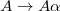{ width="60" } для фиксированного нетерминала 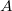{ width="12" }.

1. Запишем все правила вывода из { width="12" } в виде:

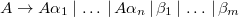{ width="239" }, где:

- 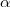{ width="10" } — это непустая последовательность терминалов и нетерминалов

(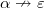{ width="45" });

- 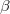{ width="10" } — это непустая последовательность терминалов и нетерминалов, не начинающаяся с { width="12" }.

<ol start="2" markdown>
<li markdown="span">Заменим правила вывода из { width="12" } на 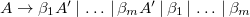{ width="250" }.</li>
<li markdown="span">Создадим новый нетерминал 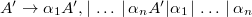{ width="252" }.</li>
</ol>

Изначально нетерминал { width="12" } порождает сроки вида 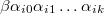{ width="104" }.

В новой грамматике нетерминал { width="12" } порождает 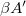{ width="26" }, а 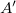{ width="16" } порождает строки вида 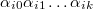{ width="93" }.

Перейдем непосредственно к примеру:

пусть у нас имеется грамматика:

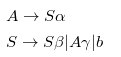{ width="149" }

Применяя алгоритм, устраняем неявную левую рекурсию:

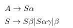{ width="172" }

Устраняем непосредственную левую рекурсию:

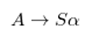{ width="87" }

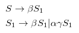{ width="162" }

<strong>Алгоритм «Левая факторизация КС-грамматики»</strong>

<strong>Вход:</strong>

Грамматика <strong>G</strong>.

<strong>Выход:</strong>

Эквивалентная левофакторизованная грамматика

<strong>Метод:</strong>

Для каждого нетерминала <strong>А</strong> находим наидлиннейший префикс <strong>α</strong>, общий для двух или большего числа альтернатив.

Если <strong>α≠ε</strong>, т е имеется нетривиальный общий префикс, заменим все продукции <strong>А→αβ<sub>1</sub>| αβ<sub>2</sub>| …| αβ<sub>n</sub>| γ</strong>, где <strong>γ</strong> представляет все альтернативы, не начинающиеся с <strong>α</strong>, продукциями:

```text
A  → α A’ | γ
A’ → β1 | β2 | … | βn
```

Здесь <strong>А’</strong> – новый нетерминал.

Выполняем это преобразование до тех пор, пока никакие две альтернативы не будут иметь общий префикс.

## Условие { #uslovie }

1. По описанию языка построить порождающую грамматику.
1. Определить тип построенной грамматики и свойства.
1. Построить для трех примеров деревья разбора.
1. Если грамматика является леворекурсивной, то устранить её.
1. Если грамматика является не левофакторизованной, то левофакторизовать.
1. Для модифицированной грамматики построить деревья разбора по тем же примерам что и в п.3

## Варианты { #varianty }

| № | Формулировка варианта задания |
|---|---|
| 1 | &lt;E&gt; ::= &lt;E&gt; ‘+’ &lt;E&gt; \| &lt;E&gt; ‘\*’ &lt;E&gt; \| ‘(‘ &lt;E&gt; ‘)’ \| ‘i’ |
| 2 | &lt;S&gt; ::= ‘if’ &lt;E&gt; ‘then’ &lt;O&gt; \[ ‘else’ &lt;O&gt; \]<br>&lt;E&gt; ::= ‘i’ \| ‘i’ ‘==’ &lt;E&gt;<br>&lt;O&gt; ::= ‘o’ … |
| 3 | 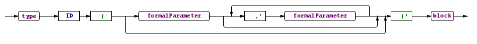{ width="623" }<br>type:<br>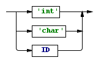{ width="136" }<br>formalParameter:<br>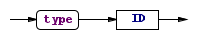{ width="165" }<br>block:<br>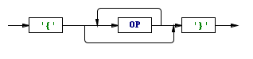{ width="254" } |
| 4 | 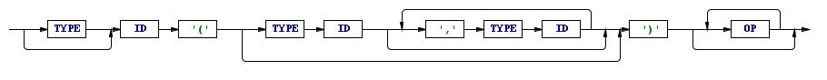{ width="623" } |
| 5 | &lt;P&gt; ::= \[ &lt;H&gt; \] &lt;B&gt;<br>&lt;H&gt; ::= ‘h’ (‘t’ ‘i’)…<br>&lt;B&gt; ::= ‘b’ (‘,’ ‘b’)… ‘;’ |
| 6 | &lt;P&gt; ::= &lt;H&gt; \[ &lt;B&gt; \]<br>&lt;H&gt; ::= ‘h’ (‘t’ ‘i’)…<br>&lt;B&gt; ::= ‘b’ (‘,’ ‘b’)… ‘;’ |
| 7 | &lt;P&gt; ::= \[ &lt;H&gt; \] \[ &lt;B&gt; \]<br>&lt;H&gt; ::= ‘h’ (‘t’ ‘i’)…<br>&lt;B&gt; ::= ‘b’ (‘,’ ‘b’)… ‘;’ |
| 8 | &lt;P&gt; ::=  &lt;H&gt; (&lt;B&gt;)…<br>&lt;H&gt; ::= ‘h’ (‘t’ ‘i’)…<br>&lt;B&gt; ::= ‘b’ (‘,’ ‘b’)… ‘;’ |
| 9 | &lt;P&gt; ::= \[ &lt;H&gt; \] &lt;B&gt;<br>&lt;H&gt; ::= ‘h’ (‘t’ ‘i’)…<br>&lt;B&gt; ::= ‘b’ (‘,’ ‘b’)… \[‘;’\] |
| 10 | &lt;P&gt; ::= \[ &lt;H&gt; \] &lt;B&gt;<br>&lt;H&gt; ::= \[‘h’\] (‘t’ ‘i’)…<br>&lt;B&gt; ::= ‘b’ (‘,’ ‘b’)… \[‘;’\] |
| 11 | &lt;P&gt; ::=  &lt;H&gt; \[ &lt;B&gt; \]<br>&lt;H&gt; ::= \[‘h’\] (‘t’ ‘i’)…<br>&lt;B&gt; ::= ‘b’ ( \[ ‘,’ \] ‘b’)… ‘;’ |
| 12 | &lt;P&gt; ::=  &lt;H&gt;… \[ &lt;B&gt; \]<br>&lt;H&gt; ::= \[‘h’\] (‘t’ ‘i’)…<br>&lt;B&gt; ::= ‘b’ ( \[ ‘,’ \] ‘b’)… \[ ‘;’ \] |
| 13 | &lt;P&gt; ::=  &lt;H&gt; \[ &lt;B&gt;… \]<br>&lt;H&gt; ::= \[‘h’\] (‘t’ ‘i’)…<br>&lt;B&gt; ::= \[‘b’\] ( \[‘,’\] ‘b’)… ‘;’ |
| 14 | &lt;P&gt; ::= (\[ &lt;H&gt; \] \[ &lt;B&gt; \])…<br>&lt;H&gt; ::= ‘h’ (‘t’ ‘i’)…<br>&lt;B&gt; ::= ‘b’ (‘,’ ‘b’)… ‘;’ |
| 15 | &lt;P&gt; ::= (&lt;H&gt; \| &lt;B&gt;)…<br>&lt;H&gt; ::= ‘h’ (‘t’ ‘i’)…<br>&lt;B&gt; ::= ‘b’ (‘,’ ‘b’)… ‘;’ |
| 16 | &lt;P&gt; ::= &lt;H&gt; \[ &lt;B&gt; \]<br>&lt;H&gt; ::= ‘h’ (‘t’ ‘i’)… \| ε<br>&lt;B&gt; ::= ‘b’ (‘,’ ‘b’)… ‘;’ |
| 17 | &lt;E&gt; ::= &lt;E&gt; ‘-’ &lt;E&gt; \| &lt;E&gt; ‘+’ &lt;E&gt; \| ‘(‘ &lt;E&gt; ‘)’ \| ‘i’ |
| 18 | &lt;S&gt; ::= ‘if’ &lt;E&gt; ‘then’ &lt;O&gt; \[ ‘else’ &lt;O&gt; \]<br>&lt;E&gt; ::= ‘i’ \| ‘i’ ‘&lt;&gt;’ &lt;E&gt;<br>&lt;O&gt; ::= ‘o’ &lt;O&gt; \| &lt;S&gt; \| ‘o’ |
| 19 | 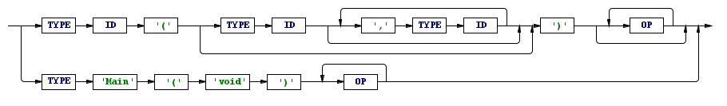{ width="623" } |
| 20 | h: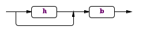{ width="190" }<br>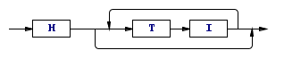{ width="254" }<br>b:<br>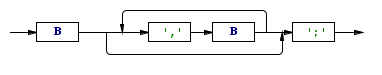{ width="306" } |
| 21 | 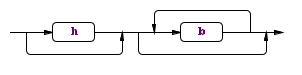{ width="242" }<br>h:<br>{ width="254" }<br>b:<br>{ width="306" } |
| 22 | 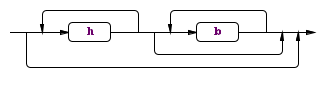{ width="267" }<br>h:<br>{ width="254" }<br>b:<br>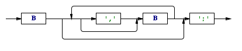{ width="331" } |
| 23 | { width="267" }<br>h:<br>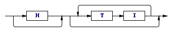{ width="280" }<br>b:<br>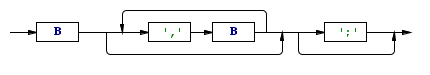{ width="344" } |
| 24 | &lt;S&gt; ::= ‘if’ \[ &lt;E&gt; \] ( \[ ‘i’ ‘:’ \] ‘then’ &lt;O&gt; )…<br>&lt;E&gt; ::= ‘i’ \| ‘i’ ‘&lt;&gt;’ &lt;E&gt;<br>&lt;O&gt; ::= ‘o’ &lt;O&gt; \| &lt;S&gt; \| ‘o’ |
| 25 | &lt;S&gt; ::= ‘if’ \[ &lt;E&gt; \] ( ‘i’ ‘:’ ‘then’ &lt;O&gt; )…<br>&lt;E&gt; ::= ‘i’ \| ‘i’ ‘&lt;&gt;’ &lt;E&gt;<br>&lt;O&gt; ::= ‘o’ &lt;O&gt; \| ‘o’ |
| 26 | &lt;S&gt; ::= ‘if’ \[ &lt;E&gt; \] ( ‘i’ ‘:’ ‘then’ &lt;O&gt; )…<br>&lt;E&gt; ::= ‘i’ \| ‘i’ ‘&lt;&gt;’ &lt;E&gt;<br>&lt;O&gt; ::= ‘o’ &lt;O&gt; \| &lt;S&gt; \| ‘o’ |
| 27 | &lt;S&gt; ::= ‘if’ \[ &lt;E&gt; \] ‘then’ &lt;O&gt; \| &lt;O&gt;<br>&lt;E&gt; ::= ‘i’ \| ‘i’ ‘&lt;&gt;’ &lt;E&gt;<br>&lt;O&gt; ::= ‘o’ &lt;O&gt; \| &lt;S&gt; \| ‘o’ |
| 28 | &lt;S&gt; ::= ‘if’ \[ &lt;E&gt; \] ‘then’ &lt;O&gt; \[ ‘else’ &lt;O&gt; \] \| &lt;O&gt;<br>&lt;E&gt; ::= ‘i’ \| ‘i’ ‘&lt;&gt;’ &lt;E&gt;<br>&lt;O&gt; ::= ‘o’ &lt;O&gt; \| &lt;S&gt; \| ‘o’ |
| 29 | &lt;S&gt; ::= ‘if’ \[ &lt;E&gt; \] ‘then’ &lt;O&gt; \[ ‘else’ &lt;O&gt; \]<br>&lt;E&gt; ::= ‘i’ \| ‘i’ ‘&lt;&gt;’ &lt;E&gt;<br>&lt;O&gt; ::= ‘o’ &lt;O&gt; \| &lt;S&gt; \| ‘o’ |
| 30 | &lt;E&gt; ::= &lt;E&gt; ‘\*’ &lt;E&gt; \| &lt;E&gt; ‘=’ &lt;E&gt; \| ‘(‘ &lt;E&gt; ‘)’ \| ‘i’ |

## Пример построения КС-грамматики { #primer }

1. Дано описание языка:

```text
<P> ::=  <H> (<B>)…
<H> ::= ‘h’ (‘t’ ‘i’)…
<B> ::= ‘b’ (‘,’ ‘b’)… ‘;’
```

<ol start="2" markdown>
<li markdown="span">Построим грамматику по описанию языка:</li>
</ol>

```text
P -> H            P -> HG                 G -> BG           G -> ε
H -> hN            N -> tiN          N -> ε
B -> bM;         M -> ,bM                 M -> ε
```

<ol start="3" markdown>
<li markdown="span">Грамматика является <em>контекстно-свободной (КС)</em>, потому что символы левой части – нетерминалы, а символы правой части – терминалы или нетерминалы.</li>
<li markdown="span">Построим для трех примеров деревья разбора:</li>
</ol>

1. <strong>htiti</strong>

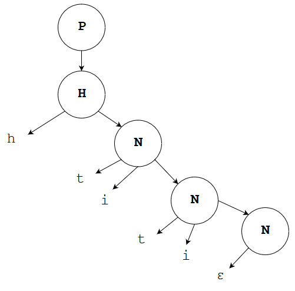{ width="292" }

<ol start="2" markdown>
<li markdown="span"><strong>htib,b;</strong></li>
</ol>

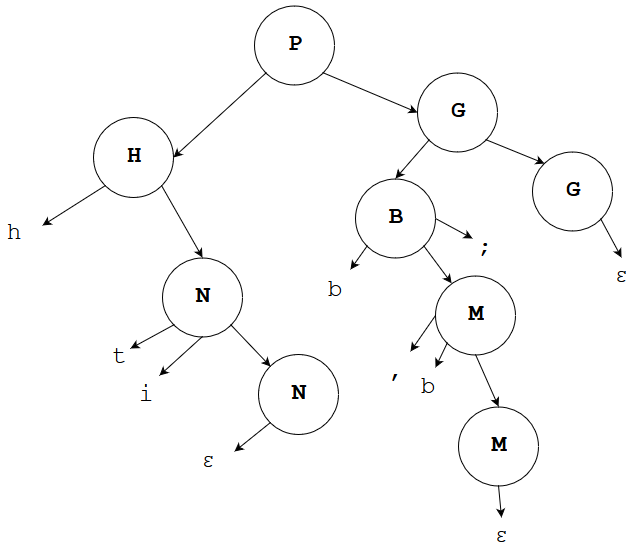{ width="395" }

<ol start="3" markdown>
<li markdown="span"><strong>htib,b;b,b,b;</strong></li>
</ol>

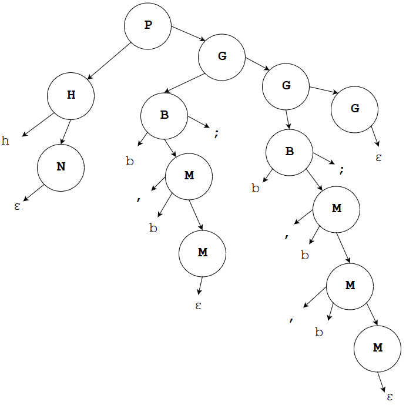{ width="378" }

<ol start="5" markdown>
<li markdown="span">Грамматика не является леворекурсивной, потому что не встречается правила вида <strong>А -&gt; Aα.</strong></li>
<li markdown="span">Грамматика является нелевофакторизованной, потому что встречаются правила вида:</li>
</ol>

<strong>А -&gt; аС</strong>

<strong>А -&gt; аD</strong>

Левофакторизуем грамматику:

заменим P -&gt; H и P -&gt; HG на P -&gt; HC

где C -&gt; G ,  C -&gt; Ɛ.

Преобразованная грамматика будет выглядеть следующим образом:

```text
P -> HC            C -> G            C -> ε         G -> BG   G -> ε
H -> hN            N -> tiN          N -> ε
B -> bM;         M -> ,bM                 M -> ε
```

Так как C -&gt; G ,  C -&gt; Ɛ , а    G -&gt; BG         ,  G -&gt; ε , то можно опустить  C и записать так:

```text
P -> HG            G -> BG                G -> ε
H -> hN            N -> tiN          N -> ε
B -> bM;         M -> ,bM                 M -> ε
```

<ol start="7" markdown>
<li markdown="span">По преобразованной грамматике построим деревья разбора</li>
</ol>

1. <strong>htiti</strong>

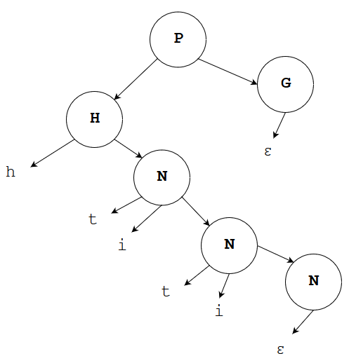{ width="272" }

<ol start="2" markdown>
<li markdown="span"><strong>htib,b;</strong></li>
</ol>

{ width="364" }

<ol start="3" markdown>
<li markdown="span"><strong>htib,b;b,b,b;</strong></li>
</ol>

{ width="438" }
