<!-- Перенесено из Google Docs «Практические задачи» (2026-09-24).
     Источник правды теперь этот файл; рисунки — docs/practice/img/. -->

# Задача 4. Построение таблицы SLR-анализатора

*[Практические занятия](index.md#tema-2) · слайды: [06. Построение синтаксического анализатора](../lectures/html/06-postroenie-sintaksicheskogo-analizatora.html) ·
[условие](#uslovie) · [варианты](#varianty) · [пример решения](#primer)*

## Теоретические сведения { #teoriya }

<strong>Основная идея SLR-метода</strong> – построение на базе грамматики ДКА для распознавания активных префиксов. Мы группируем пункты в множества, которые приводят к состояниям SLR-анализатора. Пункты могут рассматриваться как состояния НДКА, распознающего активные префиксы.

Каноническая система LR(0)-пунктов обеспечивает основу для построения SLR-анализаторов.

В данной задаче будет рассмотрен метод восходящего синтаксического анализа, известный как синтаксический анализ типа «перенос/свертка» (ПС-анализ).

<strong>Восходящий синтаксический анализ</strong> – такой вид синтаксического анализа, который пытается строить дерево разбора для входной строки, начиная с листьев (снизу) и работая по направлению к корню дерева (вверх).

Пусть 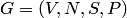{ width="127" } — КС-грамматика, 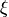{ width="9" } — цепочка в объединенном алфавите, 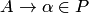{ width="89" }.

При 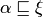{ width="44" }вхождение 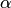{ width="11" } в 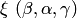{ width="77" } называют основой, если цепочка 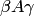{ width="34" } выводима из аксиомы 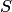{ width="12" } при условии, что цепочка { width="9" } выводима из аксиомы { width="12" }.

Таким образом, по определению, основа — это такое вхождение правой части некоторого правила КС-грамматики в некоторую выводимую из аксиомы цепочку, что после замены этой правой части соответствующим нетерминалом полученная цепочка снова будет выводимой из аксиомы. Заметим, что для не выводимой из аксиомы цепочки любое вхождение правой части некоторого правила в нее можно считать основой.

<strong>LR-грамматика</strong> – такая грамматика, для которой возможно построить таблицу синтаксического анализа. Интуитивно, для того, чтобы грамматика была LR-грамматикой, достаточно, чтобы ПС-анализатор, читающий входной поток слева направо, был способен распознавать основы только при их появлении в стеке.

Рассмотрим наиболее простой метод LR-анализа, который называется <strong>SLR-анализом</strong> (Simple LR, простой LR). Недостатком этого метода является достаточно небольшое число грамматик, с которыми он работает, однако этот метод наиболее прост в реализации. Таблицу, построенную таким методом, будем называть SLR-таблицей, а синтаксический анализатор, работающий с SLR-таблицей, SLR-анализатором (а соответствующую грамматику – SLR-грамматикой).

<strong>LR(0)-пункт</strong>, или <strong>элемент</strong> грамматики G – продукция G с точкой в некоторой позиции правой части. Следовательно, продукция, A -&gt; XYZ дает четыре пункта:

1. A -&gt; ∙XYZ
1. A -&gt; X∙YZ
1. A -&gt; XY∙Z
1. A -&gt; XYZ

Продукция A -&gt; ε генерирует только один пункт, A -&gt; ∙ . Интуитивно, пункт указывает, какую часть продукции мы уже увидели в данной точке в процессе синтаксического анализа. Например, первый пункт, приведенный выше, определяет, что во входном потоке мы ожидаем встретить строку, порождаемую XYZ. Второй пункт указывает, что у нас уже есть строка, порожденная X, и мы ожидаем получить из входного потока строку, порождаемую YZ.

Система LR(0)-пунктов, которую назовем <em>канонической,</em> обеспечивает основу для построения SLR-анализаторов. Для построения канонической LR(0)-системы грамматики мы определим расширенную грамматику и две функции – <strong>closure</strong> и <strong>goto</strong>.

Если G – грамматика со стартовым символом S, то G’, <em>расширенная грамматика (augmented grammar)</em> грамматика G, представляет собой G с новым стартовым символом S’ и продукцией S’ -&gt; S. Назначение этой новой стартовой продукции – указать синтаксическому анализатору, когда он должен прекратить разбор и объявить о допущении входной строки. Таким образом, допуск строки происходит тогда и только тогда, когда синтаксический анализатор выполняет свертку, соответствующую продукции S’ -&gt; S.

<strong>Операция замыкания (closure).</strong>

Если I – множество пунктов грамматики G, то closure(I) – множество пунктов, построенное из I по следующим правилам.

1. Изначально в closure(I) входят все пункты из I.
1. Если A -&gt; α∙Bβ входит в closure(I) и B -&gt; γ представляет собой продукцию, то добавляем в closure(I) пункт B -&gt; ∙γ (если его там еще нет). Мы применяем это правило до тех пор, пока не внесем все возможные пункты в closure(I).

Наличие A -&gt; α∙Bβ в closure(I) указывает, что в некоторый момент в процессе синтаксического анализа мы полагаем, что можем встретить во входном потоке подстроку, выводимую из Bβ. Но если имеется продукция B -&gt; γ, то, естественно, мы также можем встретить в этот момент строку, выводимую из γ, поэтому включаем B -&gt; ∙γ в closure(I).

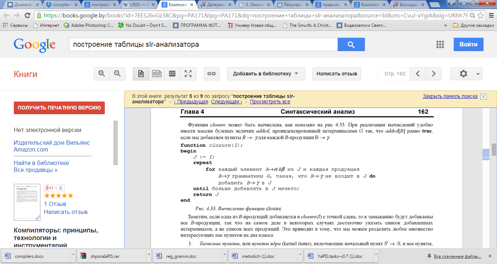{ width="624" }

<strong>Операция goto.</strong>

Второй полезной функцией является goto(I, X), где I является множеством пунктов, а X – символом грамматики. goto(I, X) определяется как замыкание (closure) множества всех пунктов \[A -&gt; α∙Bβ\] ϵ I. Интуитивно, если I является множеством пунктов, допустимых для некоторого активного префикса γ, то goto(I, X) есть множество пунктов, допустимых для активного префикса γX.

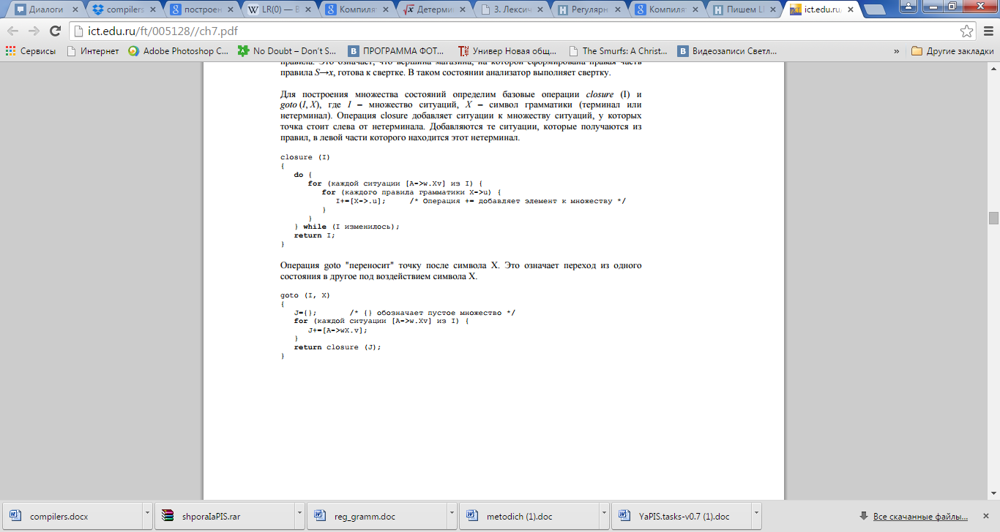{ width="624" }

<strong>Алгоритм построения C системы множества пунктов для расширенной грамматики G’</strong>

Приведем алгоритм, который позволяет построить каноническую систему LR(0)-пунктов для некоторой расширенной грамматики. Данный алгоритм использует описанные выше операции closure и goto.

```text
procedure items(G’);
begin
        C := {closure( { [S’ -> ∙S] } ) };
        repeat
                for каждое множество пунктов I в С и каждый символ грамматики X,
                    такой, что goto(I, X) не является пустым и не принадлежит C do
                        добавить goto(I, X) к С
                until больше нет множеств, которые можно добавить к C
end
```

<strong>Алгоритм 4.1.</strong>

<strong>Алгоритм построения таблицы SLR-анализатора.</strong>

Данный алгоритм строит функции <strong>action</strong> и <strong>goto</strong> SLR-анализа (эти функции будут описаны ниже при описании алгоритма LR-анализа. Он <em>не дает</em> однозначно определенные таблицы действий для всех грамматик, но он успешно работает для многих грамматик языков программирования.  Данную грамматику G необходимо расширить до грамматики G’, и на основе G’ строим C – каноническую систему множества пунктов для G’ (алгоритм 4.1.). По системе C строим <strong>action</strong>, функцию действий синтаксического анализа, и <strong>goto</strong>, функцию переходов, в соответствии с приведенным далее алгоритмом. Он требует знания FOLLOW(A) для каждого нетерминала A грамматики.

<em>Вход.</em> Расширенная грамматика G’

<em>Выход.</em> Функции <strong>action</strong> и <strong>goto</strong> таблицы SLR-анализа для грамматики G’.

<em>Алгоритм.</em>

1. Построим C = {I<sub>0</sub>, I<sub>1</sub>, …, I<sub>n</sub>} -  систему множества LR(0)-пунктов для грамматики G’.
1. Состояние i строится на основе I<sub>i</sub>. Действия синтаксического анализа для состояния i определяются следующим образом:

1. Если \[A -&gt; α∙aβ\] ϵ I<sub>i</sub> и goto(I<sub>i</sub>, a) = I<sub>j</sub>, то определить action\[i, a\] как “перенос j”; здесь a должно быть нетерминалом;
1. Если \[A -&gt; α∙\] ϵ I<sub>i</sub>, то определить action\[i, a\] как “свертка A -&gt; α” для всех a из FOLLOW(A); здесь A не должно быть S’;
1. Если \[S’ -&gt; S∙\] ϵ I<sub>i</sub>, то определить action\[i, $\] как “допуск”.

<strong>Если по этим правилам генерируются конфликтующие действия, мы говорим, что грамматика не является SLR(1). Алгоритм не в состоянии построить синтаксический анализатор для нее. В этом случае необходимо преобразовать грамматику         (возможно изменение языка) для SLR(1)-анализа.</strong>

<ol start="3" markdown>
<li markdown="span">Переходы <strong>goto</strong> для состояния i и всех нетерминалов A строятся по правилу: если goto(I<sub>i</sub>, A) = I<sub>j</sub>, то goto\[i,A\] = j.</li>
<li markdown="span">Все записи, не определенные по правилам (2) и (3), указываются как “ошибка”.</li>
<li markdown="span">Начальное состояние синтаксического анализатора представляет собой состояние, построенное из множества пунктов, содержащего \[S’ -&gt; S\].</li>
</ol>

<strong>Алгоритм 4.2.</strong>

Таблица синтаксического анализа, состоящая из функций <strong>action</strong> и <strong>goto</strong>, определяемых алгоритмом 4.2., называется <em>SLR(1)-таблицей грамматики G</em>. LR-анализатор, использующий SLR(1)-таблицу для грамматики G, называется SLR(1)-анализатором для G, а         соответствующая грамматика - SLR(1)-грамматикой. Обычно при         указании SLR(1) часть “(1)” опускается, поскольку мы не работаем         более чем с одним символом предпросмотра.

<strong>Алгоритм LR-анализа.</strong>

Анализатору требуется несколько пунктов для работы:

- Сам входной поток, который будем анализироваться.
- Стек (структура данных, которая отвечает правилу LIFO(Last In First Out) для состояний парсера.
- Таблица действий. Она подсказывает, что делать в текущем состоянии и с текущим символом на входе.
- Таблица переходов. Вспомогательная таблица, которая используется в одном из действий.

Необходимо уточнить, как будет работать анализатор. Текущим состоянием считается состояние на вершине стека. Смотрим в таблицу действий (индексами являются текущий входной символ и текущее состояние). В этой таблице могут быть 4 типа записей:

- успех(accepted(accept)) — значит то, что входная строка принадлежит данной грамматике.
- пустота (error(e)) — нет никаких действий, мы в тупике, пользователь ошибся с текущим символом.
- перенос (shift(s)) — на вершину стека переносится состояние, которое отвечает входному символу, далее читается следующий символ
- свертка (reduce(r)) — в стеке набрались состояния, которые мы можем заменить одним, используя правило грамматики, здесь-то мы и берём значение в таблице переходов. Первый индекс — текущее состояние. Второй — левая часть правила. То есть во что мы свернули последовательность состояний.

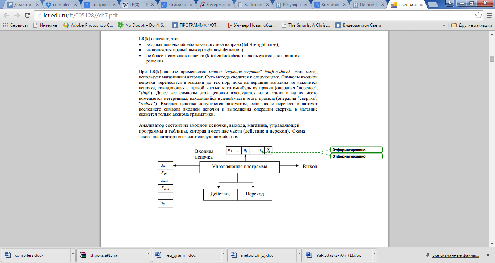{ width="624" }

<em>Модель  LR-анализатора</em>

Управляющая программа для всех LR-анализаторов одна и та же; изменяются только таблицы синтаксического анализа. Программа синтаксического анализа считывает символы из входного буфера по одному и использует стек для хранения строк вида s<sub>0</sub>X<sub>1</sub>s<sub>1</sub>X<sub>2</sub>s<sub>2</sub>…X<sub>m</sub>s<sub>m</sub> (s<sub>m</sub> находится на вершине стека). Каждый символ X<sub>i</sub> является символом грамматики, а каждый s<sub>i</sub> – символом, именуемым <em>состоянием</em>. Каждый символ состояния обобщает информацию, содержащуюся в стеке ниже его. Комбинация символа и состояния на вершине стека и текущего входного символа используется в качестве индекса таблицы синтаксического анализа и определяет дальнейшее действие – перенос или свертку. При реализации грамматические символы не обязаны появляться в стеке.

Таблица синтаксического анализа состоит из двух частей – функций действий синтаксического анализа <strong>action</strong> и функции переходов <strong>goto.</strong>  Управляющая программа LR-анализатора функционирует следующим образом. Она определяет s<sub>m</sub>, текущее состояние на вершине стека, и a<sub>i</sub>, текущий входной символ. Затем программа обращается к action\[s<sub>m</sub>, a<sub>i</sub>\], ячейке таблицы действий синтаксического анализа, определяемой состоянием s<sub>m</sub> и символами a<sub>i</sub>, которая может иметь одно из четырех значений:

1. перенос s, где s – состояние;
1. свертка в соответствии с продукцией A -&gt; β;
1. допуск (accept);
1. ошибка (error);

Функция goto получает в качестве аргументов состояние и символ грамматики и возвращает новое состояние.

<em>Конфигурация</em> LR-анализатора представляет собой пару, первый компонент которой – содержимое стека, а второй – непросмотренная часть входного потока: (s<sub>0</sub>X<sub>1</sub>s<sub>1</sub>X<sub>2</sub>s<sub>2</sub>…X<sub>m</sub>s<sub>m</sub>, a<sub>i</sub>a<sub>i+1</sub>…a<sub>n</sub>$).

Следующий шаг синтаксического анализатора определяется текущим входным символом a<sub>i</sub> и состоянием на вершине стека s<sub>m</sub> в соответствии со значением ячейки таблицы action\[s<sub>m</sub>, a<sub>i</sub>\]. Конфигурации, получаемые после каждого из четырех типов действий следующие:

1. Если action\[s<sub>m</sub>, a<sub>i</sub>\] = “перенос s”, синтаксический анализатор выполняет перенос, переходя в конфигурацию (s<sub>0</sub>X<sub>1</sub>s<sub>1</sub>X<sub>2</sub>s<sub>2</sub>…X<sub>m</sub>s<sub>m</sub>a<sub>i</sub>s, a<sub>i+1</sub>…a<sub>n</sub>$). Синтаксический анализатор переносит в стек текущий входной символ a<sub>i</sub> и очередное состояние s, определяемое значением action\[s<sub>m</sub>, a<sub>i</sub>\]; текущим входным символом становится a<sub>i+1</sub>.
1. Если action\[s<sub>m</sub>, a<sub>i</sub>\] = “свертка A -&gt; β”, то синтаксический анализатор выполняет свертку в конфигурацию (s<sub>0</sub>X<sub>1</sub>s<sub>1</sub>X<sub>2</sub>s<sub>2</sub>…X<sub>m-r</sub>s<sub>m-r</sub>As, a<sub>i</sub>a<sub>i+1</sub>…a<sub>n</sub>$), где s = goto\[s<sub>m-r</sub>, a<sub>i</sub>\], a r – длина β, правой части продукции. Здесь синтаксический анализатор вначале снимает со стека 2r символов (r символов состояний и r символов грамматики), выводя на вершину стека состояние s<sub>m-r</sub>. Затем вносит в стек A (левую часть продукции) и s, запись из ячейки goto\[s<sub>m-r</sub>, A\]. Текущий входной символ при этом не изменяется. Последовательность снимаемых со стека символов грамматики X<sub>m-r+1</sub>…X<sub>m</sub> всегда соответствуют β, правой части продукции свертки.
1. Если action\[s<sub>m</sub>, a<sub>i</sub>\] = “допуск”, синтаксический анализ завершается.
1. Если action\[s<sub>m</sub>, a<sub>i</sub>\] = “ошибка”, синтаксический анализатор обнаружил ошибку и вызывает подпрограмму восстановления после нее.

Полностью алгоритм LR-анализа приведен ниже. Все LR-анализаторы ведут себя одинаково; единственная разница между ними заключается в таблицах action и goto.

<em>Вход.</em> Входная строка w и таблица LR-анализа с функциями action и goto для грамматики G.

<em>Выход.</em> Если w ϵ L(G), выдается восходящий разбор для w; в противном случае выводится сообщение об ошибке.

<em>Алгоритм.</em> Изначально синтаксический анализатор содержит в стеке начальное состояние s<sub>0</sub>, а во входном буфере – w$. Затем анализатор выполняет приведенный ниже алгоритм до тех пор, пока не будет достигнуто успешное завершение анализа или не обнаружена ошибка.

```text
Установить указатель ip на первый символ w$;
repeat forever begin
        Пусть s – состояние на вершине стека, а a – символ, на который указывает ip
        if action[s,a] = “перенос s’” then begin
                Поместить в стек a, затем s’; переместить ip к следующему входному символу
        end
        else if action[s,a] = “свертка A -> β” then begin
                Снять со стека 2*|β| символов. Пусть s’ – текущее состояние на вершине стека.
                Поместить в стек A, затем goto[s’,A]; вывести продукцию A -> β.
        end
        else if action[s,a] = “допуск” then
                return
        else error()
end
```

<strong><em>Пример части таблицы LR-анализа.</em></strong>

<table>
<tr>
<th rowspan="2">Состояние</th>
<th colspan="6">action</th>
<th colspan="3">goto</th>
</tr>
<tr>
<th>Id</th>
<th>+</th>
<th>*</th>
<th>(</th>
<th>)</th>
<th>$</th>
<th>E</th>
<th>T</th>
<th>F</th>
</tr>
<tr>
<td>0</td>
<td>s5</td>
<td></td>
<td></td>
<td>s4</td>
<td></td>
<td></td>
<td>1</td>
<td>2</td>
<td>3</td>
</tr>
<tr>
<td>1</td>
<td></td>
<td>s6</td>
<td></td>
<td></td>
<td></td>
<td>accept</td>
<td></td>
<td></td>
<td></td>
</tr>
<tr>
<td>2</td>
<td></td>
<td>r2</td>
<td>s7</td>
<td></td>
<td>r2</td>
<td>r2</td>
<td></td>
<td></td>
<td></td>
</tr>
</table>

Поясним обозначения в данной таблице.

- s<sub>i</sub> означает перенос и i-е состояние на вершине стека,
- r<sub>j</sub> означает свертку в соответствии с продукцией номер j,
- accept означает допуск входной строки,
- пустая ячейка означает ошибку,
- В части <strong>action</strong> находятся терминальные символы грамматики, в части <strong>goto</strong>, соответственно, нетерминальные.

## Условие { #uslovie }

1. Определить значение функций FIRST и FOLLOW для разработанной грамматики.
1. Построить множество пунктов.
1. Построить диаграмму переходов.
1. Построить таблицу SLR анализатора c учетом вариантов восстановления после ошибок.
1. Проверить правильность построения на трех примерах (один правильный, два неправильных).

## Варианты { #varianty }

| № | Формулировка варианта задания |
|---|---|
| 1 | S -&gt; Aa<br>A -&gt; Ab \| Bb<br>B -&gt; cB \| ε |
| 2 | S -&gt; ABC<br>A -&gt; BC \| a<br>B -&gt; A \| b<br>C -&gt; c \| ε |
| 3 | S -&gt; AB<br>A -&gt; aAb \| Ab \| ε<br>B -&gt; bB \| b |
| 4 | S -&gt; aAb<br>A -&gt; BC \| bc<br>B -&gt; Aa<br>C -&gt; c \| ε |
| 5 | S -&gt; AS \| c<br>A -&gt; Aa \| Ca<br>C -&gt; cA \|  c |
| 6 | S -&gt; BS \| c<br>A -&gt; cB \|  c<br>B -&gt; Ba \| Aa |
| 7 | S -&gt; ABc<br>A -&gt; aAb \| Ab \| ε<br>B -&gt; bB \| bA |
| 8 | S -&gt; Aa<br>A -&gt; Ac \| Bb \|  ε<br>B -&gt; cB \|  ε |
| 9 | S -&gt; aBS \| c<br>A -&gt; cB \|  c<br>B -&gt; Ba \| Aa \|  ε |
| 10 | S -&gt; AC \| c<br>A -&gt; Aa \| Ca<br>C -&gt; cA \|  c |
| 11 | S -&gt; SA \| c<br>A -&gt; Aa \| Ca<br>C -&gt; cA \|  c |
| 12 | S -&gt; aAb<br>A -&gt; BS \| bc<br>B -&gt; AaC<br>C -&gt; c \| ε |
| 13 | S -&gt; aB \| c<br>A -&gt; cB \|  c<br>B -&gt; Ba \| Aa \|  ε |
| 14 | S -&gt; ABC<br>A -&gt; BC \| a<br>B -&gt; A \| b<br>C -&gt; c \| ε |
| 15 | S -&gt; AB<br>A -&gt; aAb \| Ab \| ε<br>B -&gt; bB \| b |
| 16 | S -&gt; aAb<br>A -&gt; BC \| bc<br>B -&gt; Aa<br>C -&gt; c \| ε |
| 17 | S -&gt; AS \| c<br>A -&gt; Aa \| Ca<br>C -&gt; cA \|  c |
| 18 | S -&gt; BS \| c<br>A -&gt; cB \|  c<br>B -&gt; Ba \| Aa |
| 19 | S -&gt; ABc<br>A -&gt; aAb \| Ab \| ε<br>B -&gt; bB \| bA |
| 20 | S -&gt; Aa<br>A -&gt; Ac \| Bb \|  ε<br>B -&gt; cB \|  ε |
| 21 | S -&gt; aBS \| c<br>A -&gt; cB \|  c<br>B -&gt; Ba \| Aa \|  ε |
| 22 | S -&gt; AC \| c<br>A -&gt; Aa \| Ca<br>C -&gt; cA \|  c |
| 23 | S -&gt; AC \| c<br>A -&gt; Aa \| Ca<br>C -&gt; cA \|  c |
| 24 | S -&gt; SA \| c<br>A -&gt; Aa \| Ca<br>C -&gt; cA \|  c |
| 25 | S -&gt; aAb<br>A -&gt; BS \| bc<br>B -&gt; AaC<br>C -&gt; c \| ε |
| 26 | S -&gt; aB \| c<br>A -&gt; cB \|  c<br>B -&gt; Ba \| Aa \|  ε |
| 27 | S -&gt; ABC<br>A -&gt; BC \| a<br>B -&gt; A \| b<br>C -&gt; c \| ε |
| 28 | S -&gt; AB<br>A -&gt; aAb \| Ab \| ε<br>B -&gt; bB \| b |
| 29 | S -&gt; aAb<br>A -&gt; BC \| bc<br>B -&gt; Aa<br>C -&gt; c \| ε |
| 30 | S -&gt; AS \| c<br>A -&gt; Aa \| Ca<br>C -&gt; cA \|  c |

## Пример построения таблицы SLR-анализатора { #primer }

1. Исходная грамматика для декларации функции:

```text
S -> Aa
A -> Ac|Bb|ε
B -> cB| ε
```

<ol start="2" markdown>
<li markdown="span">Видим, что присутствует левая рекурсия. Избавляемся от нее:</li>
</ol>

```text
S -> Aa
A -> cA|Bb|ε
B -> cB| ε
```

<ol start="3" markdown>
<li markdown="span">Построим функции FIRST и FOLLOW для грамматики, заданной в условии:</li>
</ol>

```text
FIRST(S) = {a, b, c}    FOLLOW(S) = {$}
FIRST(A) = {c, b, ε}    FOLLOW(A) = {a}
FIRST(B) = {c, ε}       FOLLOW(B) = {b}
```

<ol start="4" markdown>
<li markdown="span">Построим множество пунктов. Для этого пронумеруем правила и добавим фиктивное нулевое правило.  После этого грамматика примет вид:</li>
</ol>

```text
1) S’ -> S
2) S -> Aa
3) A -> cA
4) A -> bB
5) A -> ε
6) B -> cB
7) B -> ε
```

А) Нулевой пункт I<sub>0</sub> будет состоять из результата функции

closure( { \[S’ -&gt; ∙S\] } )

Б) Подсчитываем результат функции closure({\[S’ -&gt; ∙S\]})

i) I<sub>0</sub>={ S’ -&gt; ∙S}; Поскольку пункт стоит перед         нетерминалом S, то пытаемся добавить в I<sub>0</sub> пункт S -&gt; ∙Aa; Такого пункта в I<sub>0</sub> нет, поэтому добавляем его.

ii) I<sub>0</sub> = { S’ -&gt; ∙S, S -&gt; ∙Aa}.Поскольку пункт стоит перед нетерминалом A, то пытаемся добавить в I<sub>0</sub> пункты  A -&gt; ∙cA,A -&gt; -&gt; ∙bB, A -&gt; ∙; таких пунктов нет в I<sub>0</sub>, поэтому добавляем их.

iii) I<sub>0</sub> = { S’ -&gt; ∙S, S -&gt; ∙Aa, A -&gt; ∙cA, A -&gt; ∙bB, A -&gt; ∙}; Поскольку пункты стоят перед уже разобранным терминалом и нетерминалами, то множество пунктов I<sub>0</sub> сформировано.

В) Подсчитываем I<sub>1</sub> = goto(I<sub>0</sub>, S) = closure({\[S’ -&gt; S∙\]})

i) I<sub>1</sub> = {S’ -&gt; S∙}. Поскольку пункт стоит только перед символами ε, то множество пунктов I<sub>1</sub> сформировано.

Г) Подсчитываем I<sub>2</sub> = goto(I<sub>0</sub>, A) = closure({\[S -&gt; A∙a\]})

i) I<sub>2</sub> = {S -&gt; A∙a}. Поскольку пункт стоит только перед терминалами, то множество пунктов I<sub>2</sub> сформировано.

Д) Подсчитываем I<sub>3</sub> = goto(I<sub>2</sub>, a) = closure ({\[S -&gt; Aa∙\]}).

i) I<sub>3</sub> = {S -&gt; Aa∙}. Поскольку пункт стоит только перед символами ε, то множество пунктов I<sub>3</sub> сформировано.

Е) Подсчитываем I<sub>4</sub> = goto(I<sub>0</sub>, с) = closure ({\[A -&gt; c∙A\]}).

i) I<sub>4</sub> = {A -&gt; c∙A}. Поскольку пункт стоит перед нетерминалом A, то пытаемся добавить в I<sub>4</sub> пункты  A -&gt; ∙cA, A -&gt; ∙bB, A -&gt; ∙; таких пунктов нет в I<sub>4</sub>, поэтому добавляем их.

ii) I<sub>4</sub> = {A -&gt; c∙A,  A -&gt; ∙cA, A -&gt; ∙bB, A -&gt; ∙}; Поскольку пункт стоит перед уже разобранным нетерминалом А и терминалами, то множество пунктов I<sub>4</sub> сформировано.

Ж) Подсчитываем I<sub>5</sub> = goto(I<sub>4</sub>, А) = closure({\[A -&gt; cA∙\]}).

i) I<sub>5</sub> = {A -&gt; cA∙}. Поскольку пункт стоит только перед символами ε, то множество пунктов I<sub>5</sub> сформировано.

З) Подсчитываем I<sub>6</sub> = goto(I<sub>0</sub>, b) = closure({\[A -&gt; b∙B\]}).

i) I<sub>6</sub> = {A -&gt; b∙B}. Поскольку пункт стоит перед нетерминалом B, то пытаемся добавить в I<sub>6</sub> пункты  B -&gt; ∙cB, B -&gt; ∙; таких пунктов нет в I<sub>6</sub>, поэтому добавляем их.

ii) I<sub>6</sub> = {A -&gt; b∙B, B -&gt; ∙cB, B -&gt; ∙}; Поскольку пункт стоит перед уже разобранным нетерминалом B и терминалами, то множество пунктов I<sub>6</sub> сформировано.

И) Подсчитываем I<sub>7</sub> = goto(I<sub>6</sub>, B) = closure({\[A -&gt; bB∙\]}).

i) I<sub>7</sub> = {A -&gt; bB∙}. Поскольку пункт стоит только перед символами ε, то множество пунктов I<sub>5</sub> сформировано.

K) Подсчитываем I<sub>8</sub> = goto(I<sub>6</sub>, c) = closure({\[B -&gt;c∙B\]}).

i) I<sub>8</sub> = {B -&gt; c∙B}. Поскольку пункт стоит перед нетерминалом B, то пытаемся добавить в I<sub>8</sub> пункты  B -&gt; ∙cB, B -&gt; ∙; таких пунктов нет в I<sub>8</sub>, поэтому добавляем их.

ii) I<sub>8</sub> = {B -&gt; c∙B, B -&gt; ∙cB, B -&gt; ∙}; Поскольку пункт стоит перед уже разобранным нетерминалом B и терминалами, то множество пунктов I<sub>8</sub> сформировано.

И) Подсчитываем I<sub>9</sub> = goto(I<sub>8</sub>, B) = closure({\[B -&gt;cB∙\]}).

i) I<sub>9</sub> = {B -&gt; cB∙}. Поскольку пункт стоит только перед символами ε, то множество пунктов I<sub>9</sub> сформировано.

К) Больше множеств пунктов построить нельзя, поскольку либо все пункты расположены либо после символов ε, либо не порождают новых состояний.

Множество пунктов для данной грамматики имеет вид:

- I<sub>0</sub> ={S’ -&gt; ∙S, S -&gt; ∙Aa, A -&gt; ∙cA, A -&gt; ∙bB, A -&gt; ∙}
- I<sub>1</sub> = {S’ -&gt; S∙}
- I<sub>2</sub> = {S -&gt; A∙ a}
- I<sub>3</sub> = {S -&gt; Aa∙}
- I<sub>4</sub> = {A -&gt; c∙A, A -&gt; ∙cA, A -&gt; ∙bB, A -&gt; ∙}
- I<sub>5</sub> = {A -&gt; cA∙}
- I<sub>6</sub> = {A -&gt; b∙B, B -&gt; ∙cB, B -&gt; ∙}
- I<sub>7</sub> = {A -&gt; bB∙}
- I<sub>8</sub> = {B -&gt; c∙B, B -&gt; ∙cB, B -&gt;∙ }
- I<sub>9</sub> = {B -&gt; cB∙}

<ol start="5" markdown>
<li markdown="span">Диаграмма переходов представляет собой ориентированный граф, вершинами которого являются состояния, а дугами – переходы между этими состояниями.</li>
</ol>

Матрица смежности этого графа будет иметь вид.

| Состояние | 0 | 1 | 2 | 3 | 4 | 5 | 6 | 7 | 8 | 9 |
|---|---|---|---|---|---|---|---|---|---|---|
| 0 | - | S | A | - | c | - | B | - | - | - |
| 1 | - | - | - | - | - | - | - | - | - | - |
| 2 | - | - | - | a | - | - | - | - | - | - |
| 3 | - | - | - | - | - | - | - | - | - | - |
| 4 | - | - | - | - | c | A | b | - | - | - |
| 5 | - | - | - | - | - | - | - | - | - | - |
| 6 | - | - | - | - | - | - | - | B | c | - |
| 7 | - | - | - | - | - | - | - | - | - | - |
| 8 | - | - | - | - | - | - | - | - | c | B |
| 9 | - | - | - | - | - | - | - | - | - | - |

Диаграмма переходов, построенная на основании приведенной выше матрицы смежности, имеет вид:

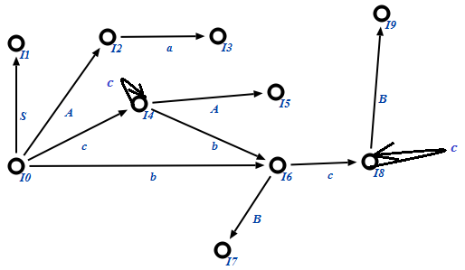{ width="514" }

<ol start="6" markdown>
<li markdown="span">Строим таблицу SLR-анализатора.</li>
</ol>

Рассматриваем последовательно каждое состояние, заполняя функции <strong>action</strong> и <strong>goto</strong> в таблице.

Таблица имеет следующий вид:

<table>
<tr>
<th rowspan="2">Состояние</th>
<th colspan="4">action</th>
<th colspan="3">goto</th>
</tr>
<tr>
<th>a</th>
<th>b</th>
<th>c</th>
<th>$</th>
<th>A</th>
<th>B</th>
<th>S</th>
</tr>
<tr>
<td>0</td>
<td>r4</td>
<td>s6</td>
<td>s4</td>
<td></td>
<td>2</td>
<td></td>
<td>1</td>
</tr>
<tr>
<td>1</td>
<td></td>
<td></td>
<td></td>
<td>accept</td>
<td></td>
<td></td>
<td></td>
</tr>
<tr>
<td>2</td>
<td>s3</td>
<td></td>
<td></td>
<td></td>
<td></td>
<td></td>
<td></td>
</tr>
<tr>
<td>3</td>
<td></td>
<td></td>
<td></td>
<td>r1</td>
<td></td>
<td></td>
<td></td>
</tr>
<tr>
<td>4</td>
<td>r4</td>
<td>s6</td>
<td>s4</td>
<td></td>
<td>5</td>
<td></td>
<td></td>
</tr>
<tr>
<td>5</td>
<td>r2</td>
<td></td>
<td></td>
<td></td>
<td></td>
<td></td>
<td></td>
</tr>
<tr>
<td>6</td>
<td>r6</td>
<td></td>
<td>s8</td>
<td></td>
<td></td>
<td>7</td>
<td></td>
</tr>
<tr>
<td>7</td>
<td>r3</td>
<td></td>
<td></td>
<td></td>
<td></td>
<td></td>
<td></td>
</tr>
<tr>
<td>8</td>
<td>r6</td>
<td></td>
<td>s8</td>
<td></td>
<td></td>
<td>9</td>
<td></td>
</tr>
<tr>
<td>9</td>
<td>r5</td>
<td></td>
<td></td>
<td></td>
<td></td>
<td></td>
<td></td>
</tr>
</table>

<ol start="7" markdown>
<li markdown="span">Примеры разбора текстов, порожденных данной грамматикой с помощью построенной таблицы SLR-анализатора.</li>
</ol>

<strong>Правильный пример:</strong>

ccbcca

| Стек | Входной поток | Комментарии |
|---|---|---|
| $0 | ccbcca$ | <em>action\[I<sub>0</sub>, c\] =  S4</em><br>Осуществляем перенос c в стек. А так же добавляем в него состояние 4. |
| $0c4 | cbcca$ | <em>action\[I<sub>4</sub>, c\] =  S4</em><br>Осуществляем перенос c в стек. А так же добавляем в него состояние 4. |
| $0c4c4 | bcca$ | <em>action\[I<sub>4</sub>, b\] =  S6</em><br>Осуществляем перенос b в стек. А так же добавляем в него состояние 6. |
| $0c4c4b6 | cca$ | <em>action\[I<sub>6</sub>, c\] =  S8</em><br>Осуществляем перенос c в стек. А так же добавляем в него состояние 8. |
| $0c4c4b6c8 | ca$ | <em>action\[I<sub>8</sub>, c\] =  S8</em><br>Осуществляем перенос c в стек. А так же добавляем в него состояние 8. |
| $0c4c4b6c8c8 | a$ | <em>action\[I<sub>8</sub>, a\] =  r6</em><br>Осуществляем свертку по правилу номер 6. Снимаем со стека 2\*0 символов, добавляем в него сворачиваемый нетерминал, а так же состояние, которое указано в ячейке <em>goto\[I<sub>8</sub>, B\] = 9</em> |
| $0c4c4b6c8c8B9 | a$ | <em>action\[I<sub>8</sub>, a\] =  r6</em><br>Осуществляем свертку по правилу номер 6. Снимаем со стека 2\*0 символов, добавляем в него сворачиваемый нетерминал, а так же состояние, которое указано в ячейке <em>goto\[I<sub>8</sub>, B\] = 9</em> |
| $0c4c4b6c8B9 | a$ | <em>action\[I<sub>6</sub>, a\] =  r6</em><br>Осуществляем свертку по правилу номер 6. Снимаем со стека 2\*0 символов, добавляем в него сворачиваемый нетерминал, а так же состояние, которое указано в ячейке <em>goto\[I<sub>6</sub>, B\] = 7</em> |
| $0c4c4b6B7 | a$ | <em>action\[I<sub>4</sub>, a\] =  r4</em><br>Осуществляем свертку по правилу номер 4. Снимаем со стека 2\*0 символов, добавляем в него сворачиваемый нетерминал, а так же состояние, которое указано в ячейке <em>goto\[I<sub>4</sub>, A\] = 5</em> |
| $0c4c4A5 | a$ | <em>action\[I<sub>4</sub>, a\] =  r4</em><br>Осуществляем свертку по правилу номер 4. Снимаем со стека 2\*0 символов, добавляем в него сворачиваемый нетерминал, а так же состояние, которое указано в ячейке <em>goto\[I<sub>4</sub>, A\] = 5</em> |
| $0c4A5 | a$ | <em>action\[I<sub>0</sub>, a\] =  r4</em><br>Осуществляем свертку по правилу номер 0. Снимаем со стека 2\*0 символов, добавляем в него сворачиваемый нетерминал, а так же состояние, которое указано в ячейке <em>goto\[I<sub>0</sub>, A\] = 2</em> |
| $0A2 | a$ | <em>action\[I<sub>2</sub>, a\] =  S3</em><br>Осуществляем перенос a в стек. Так же добавляем в него состояние 3. |
| $0A2a3 | $ | <em>action\[I<sub>3</sub>, $\] =  r1</em><br>Осуществляем свертку по правилу номер 3. Снимаем со стека 2\*0 символов, добавляем в него сворачиваемый нетерминал, а так же состояние, которое указано в ячейке <em>goto\[I<sub>3</sub>, $\] = 1</em>. |
| $0S1 | $ | <em>action\[I<sub>1</sub>, $\] =  accept</em><br>Попадаем в ячейку «accept». Строка успешно разобрана |

<strong>Неправильный пример:</strong>

cacbca

| Стек | Входной поток | Комментарии |
|---|---|---|
| $0 | cacbca$ | <em>action\[I<sub>0</sub>, c\] =  S4</em><br>Осуществляем перенос c в стек. А так же добавляем в него состояние 4. |
| $0c4 | acbca$ | <em>action\[I<sub>4</sub>, a\] =  ???</em> – ошибка!!! Так как ожидается переход по а, то есть строка неправильная. |
