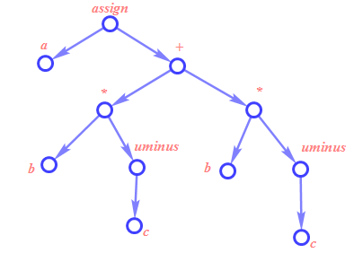
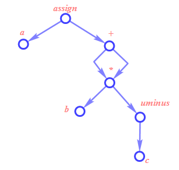
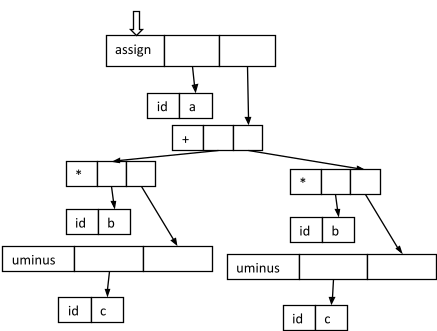
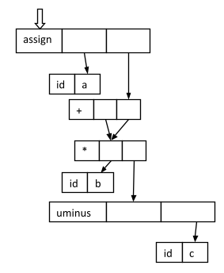
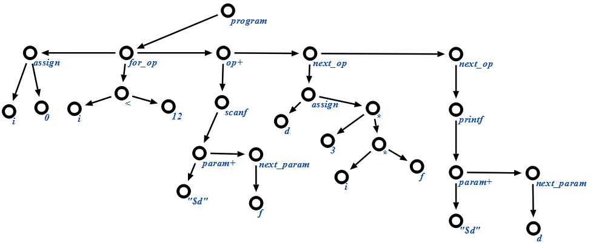
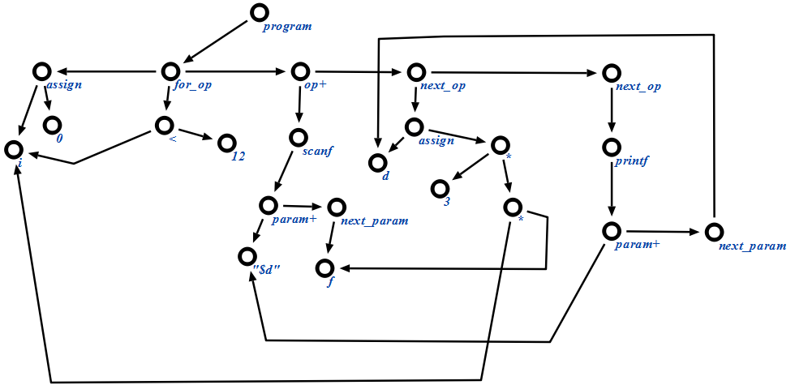
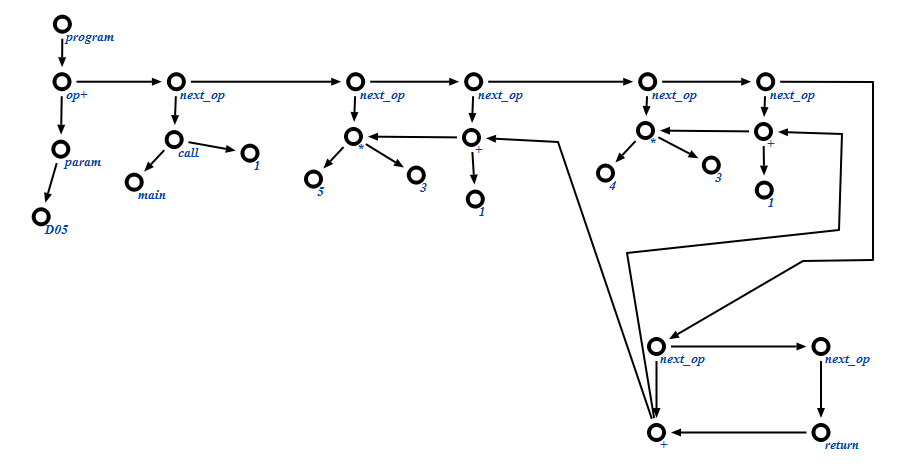

<!-- Перенесено из Google Docs «Практические задачи» (2026-09-24).
     Источник правды теперь этот файл; рисунки — docs/practice/img/. -->

# Задача 5. Синтаксически управляемая трансляция

*[Практические занятия](index.md#tema-4) · слайды: [12. Синтаксически управляемая трансляция](../lectures/html/12-sintaksicheski-upravlyaemaya-translyaciya.html) ·
[условие](#uslovie) · [варианты](#varianty) · [пример решения](#primer)*

## Теоретические сведения { #teoriya }

<strong>Синтаксически управляемая трансляция</strong> (СУТ, [англ.](https://ru.wikipedia.org/wiki/%D0%90%D0%BD%D0%B3%D0%BB%D0%B8%D0%B9%D1%81%D0%BA%D0%B8%D0%B9_%D1%8F%D0%B7%D1%8B%D0%BA) <em>Syntax-directed translation, SDT</em>) — преобразование текста в последовательность команд, через добавление таких команд в правила [грамматики](https://ru.wikipedia.org/wiki/%D0%A4%D0%BE%D1%80%D0%BC%D0%B0%D0%BB%D1%8C%D0%BD%D0%B0%D1%8F_%D0%B3%D1%80%D0%B0%D0%BC%D0%BC%D0%B0%D1%82%D0%B8%D0%BA%D0%B0). Во время обработки строки [синтаксический анализатор](https://ru.wikipedia.org/wiki/%D0%A1%D0%B8%D0%BD%D1%82%D0%B0%D0%BA%D1%81%D0%B8%D1%87%D0%B5%D1%81%D0%BA%D0%B8%D0%B9_%D0%B0%D0%BD%D0%B0%D0%BB%D0%B8%D0%B7) находит последовательность применений правил. СУТ предоставляет простой способ связи такого [синтаксиса](https://ru.wikipedia.org/wiki/%D0%A1%D0%B8%D0%BD%D1%82%D0%B0%D0%BA%D1%81%D0%B8%D1%81) с [семантикой](https://ru.wikipedia.org/wiki/%D0%A1%D0%B5%D0%BC%D0%B0%D0%BD%D1%82%D0%B8%D0%BA%D0%B0).

Синтаксически управляемая трансляция работает за счет добавления действий в [контекстно-свободную грамматику](https://ru.wikipedia.org/wiki/%D0%9A%D0%BE%D0%BD%D1%82%D0%B5%D0%BA%D1%81%D1%82%D0%BD%D0%BE-%D1%81%D0%B2%D0%BE%D0%B1%D0%BE%D0%B4%D0%BD%D0%B0%D1%8F_%D0%B3%D1%80%D0%B0%D0%BC%D0%BC%D0%B0%D1%82%D0%B8%D0%BA%D0%B0). Эти действия будут осуществляться, когда соответствующее правило используется в выводе. Описание грамматики с такими действиями называется <em>схемой синтаксически управляемой трансляции</em> (или просто <em>схемой трансляции</em>).

Каждый символ в грамматике может иметь <em>атрибуты</em>, которые содержат данные. Обычно такие атрибуты могут включать в себя тип переменной, значение выражения, и т.п. Для символа <em>X</em> с атрибутом <em>t</em> обращение к атрибуту может выглядеть как <em>X</em>.<em>t</em>.

Таким образом, используя действия и атрибуты, грамматика может быть применена для перевода текста с языка, порождаемого ею, выполнением действий и переносом информации через атрибуты символов.

Промежуточный код может иметь <strong>три типа представления:</strong>

- Синтаксические деревья
- Постфиксная запись
- Трехадресный код

Далее подробнее о каждом типе представления. Постфиксная запись в данной задаче рассматриваться не будет.

<strong>Синтаксические деревья</strong>

Синтаксические деревья бывают двух видов: <strong>собственно синтаксическое дерево</strong> и <strong>даг</strong>. Синтаксическое дерево изображает естественную иерархическую структуру исходной программы. В свою очередь, даг дает ту же информацию, но в более компактном виде (одинаковые подвыражения в нем объединены).

Приведем пример графического представления синтаксического дерева и дага для  инструкции присваивания <strong>a := b \* -c + b \* -c</strong>. Данный пример не описывает всю специфику представления промежуточного кода в виде синтаксических деревьев. Более подробный пример будет приведен в разборе задачи.

{ width="324" }

Рис. 5.1. Синтаксическое дерево для инструкции a := b \* -c + b \* -c.

{ width="240" }

Рис. 5.2. Даг для инструкции a := b \* -c + b \* -c.

Опишем примерные семантические правила, которые необходимы для построения промежуточного кода в виде синтаксического дерева для грамматики арифметических выражений.

| Продукция | Семантическое правило |
|---|---|
| S -&gt; <strong>id</strong> := E | S.nptr := mknode(‘assign’, mkleaf(<strong>id</strong>, <strong>id</strong>.place), E.nptr) |
| E -&gt; E<sub>1</sub> + E<sub>2</sub> | E.nptr := mknode(‘+’, E<sub>1</sub>.nptr, E<sub>2</sub>.nptr) |
| E -&gt; E<sub>1</sub> \* E<sub>2</sub> | E.nptr := mknode(‘\*’, E<sub>1</sub>.nptr, E<sub>2</sub>.nptr) |
| E -&gt; - E<sub>1</sub> | E.nptr := mkunode(‘uminus’, E<sub>1</sub>.nptr) |
| E -&gt; (E<sub>1</sub>) | E.nptr := E<sub>1</sub>.nptr |
| E -&gt; <strong>id</strong> | E.nptr := mkleaf(<strong>id</strong>, <strong>id</strong>.place) |

Поле нетерминального символа <strong>nptr</strong> обозначает указатель на узел некоторый дерева.

Операция <strong>mknode(name, ptr1, ptr2)</strong> позволяет создать узел дерева, который имеет название name и ссылается на узлы, обозначаемые указателями <em>ptr1</em> и <em>ptr2</em> соответственно.

Операция <strong>mkunode(name, ptr)</strong> позволяет создать узел дерева, который имеет название <em>name</em> и ссылается только на узел, обозначаемый указателем <em>ptr</em>.

Операция <strong>mkleaf(name, value)</strong> позволяет создать лист дерева, который имеет название name и значение value.

Построение дага будет осуществлено в том случае, если модифицировать правила, описанные выше, таким образом, что операции <strong>mknode(name, ptr1, ptr2)</strong> и <strong>mkunode(name, ptr)</strong> будут не сразу создавать новый узел дерева, а проверять, существует ли такой узел, и если существует, то возвращать указатель на него.

Приведем возможный вариант реализации структуры хранения для синтаксического дерева в компиляторе.

Первый вариант реализации в виде записей с указателями:

{ width="438" }

Второй вариант реализации в виде массива:

| № | Узел | Аргумент 1 | Аргумент 2 |
|---|---|---|---|
| 0 | id | b |  |
| 1 | id | c |  |
| 2 | uminus | 1 |  |
| 3 | \* | 0 | 2 |
| 4 | id | b |  |
| 5 | id | c |  |
| 6 | uminus | 5 |  |
| 7 | \* | 4 | 6 |
| 8 | + | 3 | 7 |
| 9 | id | a |  |
| 10 | assign | 9 | 8 |

Приведем так же аналогичные варианты хранения дага.

Первый вариант:

{ width="283" }

Второй вариант:

| № | Узел | Аргумент 1 | Аргумент 2 |
|---|---|---|---|
| 0 | id | b |  |
| 1 | id | c |  |
| 2 | uminus | 1 |  |
| 3 | \* | 0 | 2 |
| 4 | + | 3 | 3 |
| 5 | id | a |  |
| 6 | assign | 5 | 4 |

Как видно из размера структур данных, даг занимает меньше памяти, чем синтаксическое дерево.

<strong>Трехадресный код</strong>

Трехадресный код представляет собой последовательность инструкций вида x := y op z, где x, y, z – имена, константы, временные переменные, генерируемые компилятором; op означает некоторый оператор, например, арифметический оператор для работы с логическими значениями. Заметим, что не разрешены никакие встроенные арифметические выражения, и в правой части инструкции имеется только один оператор. Следовательно, выражение исходного языка наподобие x + y \* z может быть транслировано в следующую последовательность.

```text
        t1 := y * z
        t2 := x + t1
```

Здесь t<sub>1</sub> и t<sub>2</sub> – сгенерированные компилятором временные имена. Такое разложение сложных арифметических выражений и вложенных инструкций потока управления делает трехадресный код подходящим для генерации целевого кода и оптимизации.

Трехадресный код является линеаризованным представлением синтаксического дерева или дага, в котором внутренним узлам графа соответствуют явные имена. Покажем, как при помощи трехадресного кода представить синтаксическое дерево и даг, представленные на рис. 5.1. и 5.2., соответственно.

Код для синтаксического дерева:

```text
        t1 := - с
        t2 := b * t1
        t3 := - c
        t4 := b * t3
        a := t2 + t4
```

Код для дага:

```text
        t1 := - c
        t2 := b * t
        t3 := t2 + t2
        a := t3
```

<strong>Типы трехадресных инструкций</strong>

Трехадресные инструкции похожи на ассемблерный код.

Ниже приведен список основных трехадресных инструкций, предлагаемых для использования в данной задаче:

1. Инструкция присваивания вида x := y op z, где op – бинарная арифметическая операция или логическая операция.
1. Инструкция присваивания вида x := op y, где op – унарная операция. Основные унарные операции включают унарный минус, логическое отрицание, операторы сдвига и операторы преобразования, например, преобразуют число с фиксированной точкой в число с плавающей точкой.
1. Инструкции копирования вида x := y, в которых значение y присваивается x.
1. Безусловный переход goto L. После этой инструкции будет выполнена трехадресная инструкция с меткой L.
1. Условный переход типа if x relop y goto L. Эта инструкция применяет оператор отношения relop (&lt;, &gt;, = и т.п.) к x и y, и следующей выполняется инструкция с меткой L, если соотношение x relop y верно. В противном случае выполняется следующая за условным переходом инструкция.
1. Инструкции param x и call p, n для вызова процедур и return y для возврата из них, где y обозначает необязательное возвращаемое значение. Обычно они используются в виду следующей последовательности трехадресных инструкций.

```text
        param x1,
        param x2,
        param x3,
        …,
        param xn
        call p, n
```

Данная последовательность генерируется в качестве части вызова процедуры p(x<sub>1</sub>, x<sub>2</sub>, …, x<sub>n</sub>). В инструкции call p, n целое число n,   указывающее количество действительных параметров, не является излишним в силу того, что вызовы могут быть вложенными.

<ol start="7" markdown>
<li markdown="span">Индексированные присвоения типа x := y\[i\] и x\[i\] := y. Первая инструкция присваивает x значение, находящееся в i-й ячейке памяти по отношению к y. Инструкция x\[i\] := y заносит в i-ю ячейку памяти по отношению к x значение y. В обеих инструкциях x, y и i ссылаются на объекты данных.</li>
<li markdown="span">Присваивание адресов и указателей вида x := &amp;y, x := \*y и \*x := y. Первая инструкция устанавливает значение x равным положению y в памяти. Предположительно, y представляет собой имя, возможно временное, обозначающее выражение с l-значением типа A\[i,j\], а x – имя указателя или временное имя. Таким образом, r-значение x становится равным содержимому этой ячейки. И наконец, инструкция, \*x := y устанавливает r-значение объекта, указываемого x, равным r-значению y.</li>
</ol>

Опишем примерные семантические правила, которые необходимы для построения промежуточного кода в виде трехадресного кода для грамматики арифметических выражений.

| Продукция | Семантическое правило |
|---|---|
| S -&gt; <strong>id</strong> := E | S.code := E.code \|\| gen(id.place ‘:=’ E.place) |
| E -&gt; E<sub>1</sub> + E<sub>2</sub> | E.place := newtemp;<br>E.code := E<sub>1</sub>.code \|\| E<sub>2</sub>.code \|\| gen(E.place ‘:=’ E<sub>1</sub>.place ‘+’ E<sub>2</sub>.place) |
| E -&gt; E<sub>1</sub> \* E<sub>2</sub> | E.place := newtemp;<br>E.code := E<sub>1</sub>.code \|\| E<sub>2</sub>.code \|\| gen(E.place ‘:=’ E<sub>1</sub>.place ‘\*’ E<sub>2</sub>.place) |
| E -&gt; - E<sub>1</sub> | E.place := newtemp;<br>E.code := E<sub>1</sub>.code \|\| gen(E.place ‘:=’‘uminus’ E<sub>1</sub>.place) |
| E -&gt; (E<sub>1</sub>) | E.place := E<sub>1</sub>.place;<br>E.code := E<sub>1</sub>.code |
| E -&gt; <strong>id</strong> | E.place := id.placel<br>E.code := ‘’ |

Поле нетерминального символа <strong>place</strong> обозначает имя, которое хранит нетерминал.

Поле нетерминального символа <strong>code</strong> обозначает последовательность трехадресных инструкций, вычисляющих E.

Операция <strong>newtemp</strong> последовательно возвращает имена временных переменных t<sub>1</sub>, t<sub>2</sub>, …, .

Операция <strong>||</strong> позволяет добавить к последовательности трехадресных инструкций новые, сгенерированные при срабатывании данного правила.

Операция <strong>gen(instruction)</strong> позволяет генерировать трехадресную инструкцию, которая является конкатенацией строк, записанных в параметрах.

<strong>Реализация трехадресных инструкций</strong>

Трехадресные инструкции представляют собой абстрактный вид промежуточного кода. В компиляторе эти инструкции могут быть реализованы как записи с полями для операторов и операндов. Три возможных представления – это <em>четверки</em>, <em>тройки</em> и <em>косвенные тройки</em>.

<strong>Четверки.</strong>

Четверка (quadruple) представляет собой запись с четырьмя полями, которые назовем op, arg1, arg2, result. Поле op содержит внутренний код оператора. Трехадресная инструкция x := y op z представляется размещением y в arg1, z – в arg2 и x – в result. Инструкции с унарным оператором наподобие x := -y или x := y не используют arg2. Операторы типа param не используют ни arg2, ни result. Условные и безусловные переходы помещают в result целевую метку.

Покажем представление в виде четверок операции присваивания

a := b \* -c + b \* -c.

| <br> | op | arg1 | arg2 | result |
|---|---|---|---|---|
| (0) | uminus | c |  | t<sub>1</sub> |
| (1) | \* | b | t<sub>1</sub> | t<sub>2</sub> |
| (2) | uminus | c |  | t<sub>3</sub> |
| (3) | \* | b | t<sub>3</sub> | t<sub>4</sub> |
| (4) | + | t<sub>2</sub> | t<sub>4</sub> | t<sub>5</sub> |
| (5) | assign | t<sub>5</sub> |  | a |

<strong>Тройки.</strong>

Для того, чтобы избежать вставки временных имен в таблицу символов, мы можем ссылаться на временные значения по номеру инструкции, которая вычисляет значение, соответствующее этому имени. Если мы поступим таким образом, трехадресные инструкции можно будет представить записями только с тремя полями: op, arg1 и arg2. Поля arg1 и arg2 для аргументов op представляют собой либо указатели в таблицу символов, либо указатели на тройки. Поскольку здесь используется три поля, этот вид промежуточного кода известен как тройки (triple). За исключением представления имен, определенных в программе, тройки соответствуют представлению синтаксического дерева или графа в виде массива вершин.

Покажем представление в виде троек операции присваивания a := b \* -c + b \* -c.

|  | op | arg1 | arg2 |
|---|---|---|---|
| (0) | uminus | c |  |
| (1) | \* | b | (0) |
| (2) | uminus | c |  |
| (3) | \* | b | (2) |
| (4) | + | (1) | (3) |
| (5) | assign | а | (4) |

<strong>Косвенные тройки.</strong>

Еще одно представление трехадресного кода состоит в использовании списка указателей на тройки вместо списка самих троек. Естественно, такая реализация названа косвенными тройками (indirect triples).

Ниже приведена таблица, содержащая непосредственно тройки.

|  | op | arg1 | arg2 |
|---|---|---|---|
| (14) | uminus | c |  |
| (15) | \* | b | (14) |
| (16) | uminus | c |  |
| (17) | \* | b | (16) |
| (18) | + | (15) | (17) |
| (19) | assign | а | (18) |

Далее таблица, содержащая ссылки на эти тройки

|  | statement |
|---|---|
| (0) | (14) |
| (1) | (15) |
| (2) | (16) |
| (3) | (17) |
| (4) | (18) |
| (5) | (19) |

<strong>Оптимизация</strong>

Существует ряд способов, которыми компилятор может улучшить программу без изменения вычисляемой функции. Устранение общих подвыражений, размножение копий, удаление недоступного кода и дублирование констант – вот основные примеры таких преобразований, сохраняющих функции.

<strong>Общие подвыражения.</strong>

Выражение E называется <strong>общим подвыражением</strong>, если E было ранее вычислено и значения переменных в E с того времени не изменились. Повторного вычисления можно избежать, если использовать ранее вычисленные значения.

Приведем фрагмент кода с подвыражениями, которые будут устранены в результате оптимизации.

```text
t6 := 4 * i
x := a[t6]
t7 := 4 * i
t8 := 4 * j
t9 := a[t8]
a[t7] := t9
t10 := 4 * j
a[t10] := x
```

<p class="practice-arrow">↓</p>

```text
t6 := 4 * i
x := a[t6]
t8 := 4 * j
t9 := a[t8]
a[t6] := t9
a[t8] := x
```

<strong>Распространение копий.</strong>

Идея преобразования распространения копий заключается в использовании после присваивания  f := g переменной g вместо f везде, где это только возможно.

Сам по себе этот прием не несет в себе улучшения качества кода, однако совместно с удалением бесполезного кода, которое будет описано ниже.

Приведем фрагмент кода, в котором проведем распространение копий.

```text
x := t3
a[t2] := t5
a[t4] := x
```

<p class="practice-arrow">↓</p>

```text
x := t3
a[t2] := t5
a[t4] := t3
```

<strong>Удаление бесполезного кода.</strong>

Переменная в некоторой точке программы считается “живой”, или активной, если ее значение будет использовано в программе в последующем; в противном случае она считается “мертвой”. Очередная оптимизация касается “мертвого”, или бесполезного кода, т.е. кода, вычисляющего значения, которые никогда не будут использованы.

Таким образом, данная оптимизация совместно с распространением копий превращает инструкции копирования в мертвый код, который в последствие удаляется.

Приведем фрагмент кода, в котором удалим бесполезный код.

```text
x := t3
a[t2] := t5
a[t4] := t3
```

<p class="practice-arrow">↓</p>

```text
a[t2] := t5
a[t4] := t3
```

<strong>Построение формальной КС-грамматики, а так же ее атрибутивной грамматики с семантическими действиями более подробно описано в [лабораторном практикуме](../labs/index.md) по курсу.</strong>

## Условие { #uslovie }

1. Построить промежуточный код в указанном формате (С?) для фрагмента исходного кода (F?) на языке C.
1. Описать типологию команд промежуточного кода. Она должна соответствовать той, что описана выше в теории.
1. Над полученным промежуточным кодом провести оптимизацию. Записать протокол оптимизирующих действий.
1. Полученный после оптимизации код записать в другом формате (-&gt; C?).

## Варианты { #varianty }

| № | Фрагмент, формат → формат после оптимизации |
|---|---|
| 1 | F1,C1 -&gt; C3 |
| 2 | F1,C2 -&gt; C3 |
| 3 | F1,C3 -&gt; C1 |
| 4 | F1,C4 -&gt; C1 |
| 5 | F1,C5 -&gt; C1 |
| 6 | F2,C1 -&gt; C3 |
| 7 | F2,C2 -&gt; C3 |
| 8 | F2,C3 -&gt; C1 |
| 9 | F2,C4 -&gt; C1 |
| 10 | F2,C5 -&gt; C1 |
| 11 | F3,C1 -&gt; C3 |
| 12 | F3,C2 -&gt; C3 |
| 13 | F3,C3 -&gt; C1 |
| 14 | F3,C4 -&gt; C1 |
| 15 | F3,C5 -&gt; C1 |
| 16 | F4,C1 -&gt; C3 |
| 17 | F4,C2 -&gt; C3 |
| 18 | F4,C3 -&gt; C1 |
| 19 | F4,C4 -&gt; C1 |
| 20 | F4,C5 -&gt; C1 |
| 21 | F5,C1 -&gt; C3 |
| 22 | F5,C2 -&gt; C3 |
| 23 | F5,C3 -&gt; C1 |
| 24 | F5,C4 -&gt; C1 |
| 25 | F5,C5 -&gt; C1 |
| 26 | F6,C1 -&gt; C3 |
| 27 | F6,C2 -&gt; C3 |
| 28 | F6,C3 -&gt; C1 |
| 29 | F6,C4 -&gt; C1 |
| 30 | F6,C5 -&gt; C1 |

### Фрагменты исходного кода

**F1**

```c
int a, b, c = 1, d = c * 3;
char * s = "строка символов";
if (s[c + d] == 0) {
  a = c + 1;
  b = c + 2;
} else {
  a = d + 1;
  b = d + 2;
}
printf("Ответ: %d", a + b);
```

**F2**

```c
int f(int n) { return n * 3 + 1;}
int main(void) {
  int d = f (4);
  return f(5) + d;
}
```

**F3**

```c
for (int i = 0; i < 12; i++) {
  scanf("%d", f);
  int d = i * f * 3;
  printf("%d", d);
}
```

**F4**

```c
int a, b;
scanf("%d", a);
switch(a) {
  case 1: b = a + 1;
  case 2: b = a + 2; break;
  default: b = 0;
}
exit(b);
```

**F5**

```c
struct {int a; char b} s, f;
s.a = 1;
s.b = '3';
strcpy(&f, &s, sizeof(s));
printf("%d - %d", f.a, f.b);
```

**F6**

```c
char[] str = "string";
int a, b, c;
a = 3;
if (str[a] == '\n') {
  b = str[a-1]; c = 0;
} else {
  b = str[a+1]; c = 1;
}
str[b] = 0;
printf ("%s", str);
```

### Форматы промежуточного кода

| Код | Формат |
|---|---|
| C1 | Синтаксическое дерево |
| C2 | Даг |
| C3 | Трехадресный код. Четверки |
| C4 | Трехадресный код. Тройки |
| C5 | Трехадресный код. Косвенные тройки |

## Примеры решения задачи { #primer }

### Пример 1: F3, C1(C2) → C3

1. Фрагмент кода:

```c
for (int i = 0; i < 12; i++) {
  scanf("%d", f);
  int d = i * f * 3;
  printf("%d", d);
}
```

<ol start="2" markdown>
<li markdown="span">Построение промежуточного кода:</li>
</ol>

1. В виде синтаксического дерева:

{ width="624" }

<ol start="2" markdown>
<li markdown="span">В виде дага:</li>
</ol>

{ width="623" }

<ol start="3" markdown>
<li markdown="span">Типология команд промежуточного кода.</li>
</ol>

Для синтаксического дерева и для дага:

- program – программа. Содержит список операторов программы.
- op+ - список операторов программы. Содержит оператор и ссылку на следующий.
- next\_op – ссылка на следующий оператор списка. Содержит оператор и ссылку на следующий (ссылка может отсутствовать).
- assign – оператор присваивания. Содержит объект, которому присваивается значение и значение, которое присваивается.
- for\_op – оператор итерационного цикла. Состоит из оператора присваивания, условного оператора и списка операторов тела цикла.
- &lt; - логическая операция «меньше». Состоит из двух объектов, которые сравниваются этим оператором.
- strlen – оператор нахождения длины строки. Содержит строку, длину которой находит.
- scanf – оператор ввода. Содержит список параметров.
- param+ - список параметров функции. Содержит параметр и ссылку на следующий параметр.
- next\_param - ссылка на следующий параметр функции. Содержит параметр функции и ссылку на следующий (ссылка может отсутствовать).
- &amp; - оператор взятия адреса. Содержит объект, адрес которого берется.
- \* - оператор умножения. Содержит умножаемые числа.
- printf – оператор вывода. Содержит список параметров.
- \[\] – оператор обращения к элементу массива по индексу. Содержит массив, к которому осуществляется обращение и индекс запрашиваемого элемента.

<ol start="4" markdown>
<li markdown="span">Оптимизация промежуточного кода.</li>
</ol>

Для наглядности оптимизацию проведем над исходным кодом, затем покажем, как она отразилась на каждом виде промежуточного кода.

Проведем распространие копий:

```c
for (int i = 0; i < 12; i++) {
  scanf("%d", f);
  int d = i * f * 3;
  printf("%d", d);
}
```

<p class="practice-arrow">↓</p>

```c
for (int i = 0; i < 12; i++) {
  scanf("%d", f);
  int d = i * f * 3;
  printf("%d", i * f * 3);
}
```

Проведем удаление бесполезного кода:

```c
for (int i = 0; i < 12; i++) {
  scanf("%d", f);
  int d = i * f * 3;
  printf("%d", i * f * 3);
}
```

<p class="practice-arrow">↓</p>

```c
for (int i = 0; i < 12; i++) {
  scanf("%d", f);
  printf("%d", i * f * 3);
}
```

<ol start="5" markdown>
<li markdown="span">Запишем полученный оптимизированный промежуточный код в виде четверок.</li>
</ol>

Ячейки памяти для констант

| Номер ячейки | Значение |
|---|---|
| D01 | “%d” |

|  | Op | arg1 | arg2 | result |
|---|---|---|---|---|
| (0) | assign | 0 |  | i |
| (1) | &lt; | i | 12 | t<sub>1</sub> |
| (2) | if | t<sub>1</sub> | (4) |  |
| (3) | goto | (15) |  |  |
| (4) | param | D01 |  |  |
| (5) | param | f |  |  |
| (6) | call | scanf | 2 |  |
| (7) | param | D01 |  |  |
| (8) | \* | i | f | t<sub>2</sub> |
| (9) | \* | t<sub>2</sub> | 3 | t<sub>3</sub> |
| (10) | param | t<sub>3</sub> |  |  |
| (11) | call | printf | 2 |  |
| (12) | + | i | 1 | t<sub>4</sub> |
| (13) | assign | t<sub>4</sub> |  | i |
| (14) | goto | (1) |  |  |
| (15) |  |  |  |  |

### Пример 2: F2, C4(C5) → C1

1. Фрагмент кода:

```c
int f(int n) { return n * 3 + 1;}
int main(void) {
  int d = f (4);
  return f(5) + d;
}
```

<ol start="2" markdown>
<li markdown="span">Построение промежуточного кода:</li>
</ol>

1. В виде троек:

Ячейки памяти для констант

| Номер ячейки | Значение |
|---|---|
| D01 | 4 |
| D02 | 5 |
| D03 | 3 |
| D04 | 1 |

Для функции main:

|  | op | arg1 | arg2 |
|---|---|---|---|
| (0) | param | D01 |  |
| (1) | call | f | 1 |
| (2) | return |  |  |
| (3) | assign | d | (2) |
| (4) | param | D02 |  |
| (5) | call | f | 1 |
| (6) | return |  |  |
| (7) | + | (6) | d |
| (8) | return | (7) |  |

Для функции f:

|  | op | arg1 | arg2 |
|---|---|---|---|
| (9) | \* | n | D03 |
| (10) | + | (9) | D04 |
| (11) | return | (10) |  |
| (12) |  |  |  |

<ol start="2" markdown>
<li markdown="span">В виде косвенных троек:</li>
</ol>

Ячейки памяти для констант

| Номер ячейки | Значение |
|---|---|
| D01 | 4 |
| D02 | 5 |
| D03 | 3 |
| D04 | 1 |

Непосредственно тройки

Для функции main:

|  | op | arg1 | arg2 |
|---|---|---|---|
| (20) | param | D01 |  |
| (21) | call | f | 1 |
| (22) | return |  |  |
| (23) | assign | d | (22) |
| (24) | param | D02 |  |
| (25) | call | f | 1 |
| (26) | return |  |  |
| (27) | + | (26) | d |
| (28) | return | (27) |  |

Для функции f:

|  | op | arg1 | arg2 |
|---|---|---|---|
| (30) | \* | n | D03 |
| (31) | + | (30) | D04 |
| (32) | return | (31) |  |
| (33) |  |  |  |

Таблица, содержащая ссылки на тройки.

|  | statement |
|---|---|
| (0) | (20) |
| (1) | (21) |
| (2) | (22) |
| (3) | (23) |
| (4) | (24) |
| (5) | (25) |
| (6) | (26) |
| (7) | (27) |
| (8) | (28) |
| (9) | (30) |
| (10) | (31) |
| (11) | (32) |
| (12) | (33) |

<ol start="3" markdown>
<li markdown="span">Типология команд промежуточного кода.</li>
</ol>

Для четверок, троек и косвенных троек:

- assign – оператор присваивания. Содержит объект, которому присваивается значение и значение, которое присваивается.
- param – оператор занесения параметра в стек. Содержит параметр, заносимый в стек.
- call – вызов функции. Содержит имя вызываемой функции и число параметров, извлекаемых из стека.
- &lt; - логическая операция «меньше». Состоит из двух объектов, которые сравниваются этим оператором.
- if – оператор условного перехода. Содержит условие перехода и метку, по которой осуществляется переход. В случае выполнения условия осуществляется переход по метке, в противном случае осуществляется переход к следующей инструкции.
- goto – оператор безусловного перехода. Содержит метку, по которой осуществляется переход.
- &amp; - оператор взятия адреса. Содержит объект, адрес которого берется.
- \* - оператор умножения. Содержит умножаемые числа.
- \[\] – оператор обращения к элементу массива по индексу. Содержит массив, к которому осуществляется обращение и индекс запрашиваемого элемента.
- \+ - оператор сложения. Содержит складываемые числа.

<ol start="4" markdown>
<li markdown="span">Оптимизация промежуточного кода</li>
</ol>

Для наглядности оптимизацию проведем над исходным кодом, затем покажем, как она отразилась на каждом виде промежуточного кода.

Проведем распространие копий:

```c
int f(int n) { return n * 3 + 1;}
int main(void) {
  int d = f (4);
  return f(5) + d;
}
```

<p class="practice-arrow">↓</p>

```c
int f(int n) { return n * 3 + 1;}
int main(void) {
  int d = f (4);
  return f(5) + f(4);
}
```

Проведем удаление бесполезного кода:

```c
int f(int n) { return n * 3 + 1;}
int main(void) {
  int d = f (4);
  return f(5) + f(4) ;
}
```

<p class="practice-arrow">↓</p>

```c
int f(int n) { return n * 3 + 1;}
int main(void) {
  return f(5) + f(4);
}
```

<p class="practice-arrow">↓</p>

```c
int main(void) {
  return f(5 * 3 + 1) + f(4 * 3 + 1);
}
```

<ol start="5" markdown>
<li markdown="span">Запишем полученный оптимизированный промежуточный код в виде синтаксического дерева.</li>
</ol>

{ width="624" }
